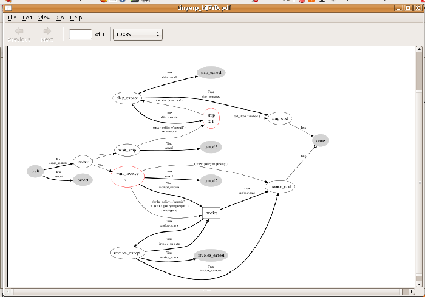
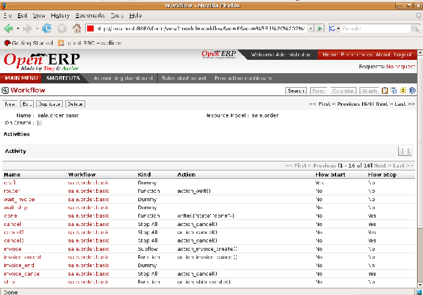

.. index::
   single: Workflows

Configuring workflows
=======================

Workflows represent the company's different business processes. They're completely configurable and define the path that any Open ERP object (such as an order) must follow depending on the conditions (for example an order over a certain value must be approved by a sales director, otherwise by any sales person, before the delivery can be triggered).

The figure below shows the standard workflow for an order. You can show it from the GTK client starting with  *Sales Management > Sales Order > All Sales Order* . Select an order, then go to the top menu  *Plugins > Execute a plugin > Print Workflow*  to show the menu below. They're designed really for administrators, so aren't available through the web client.

*Workflow for order SO005.*

Defining workflows
-------------------

Workflows can be created and modified in Open ERP's user interface.

You can look at the specifications of the workflow for the sales order above using the menu Administration * > Configuration > Low level > Base > Workflow* . It's the process named sale.order.basic. All of the nodes appearing in the graph are listed in the field  *Activities* , and all of the arrows are listed in the field  *Transitions* .

*Definition of the workflow for a sales order.*

You can also configure the workflows by adding new activities and transitions between activities or by modifying the conditions that control the existing transitions. 

.. tip::   **Technique**  *Defining workflows* 

	Workflows are defined in files named MODULE_workflow.xml which can be found in the addons directory on the server. The definition just consists of a list of activities (nodes) and transitions (arrows).

.. index::
   single: Workflows; Roles
.. 

Assigning roles
-----------------

Users can be linked to several roles specifying their duties in certain phases of different workflows accompanying the various documents. For example, if a user has taken the role of services manager he takes on the task of approving holiday requests from his staff. So his role will be integrated in the holiday request workflow.

Role definition is done in  *Administration > Users > Roles Structure > Define Roles* , the same way you define groups, except that roles can be hierarchical: a parent role has the same influence as all of its child roles (for example, the sales director would be able to do all of the things that have been defined for a sales person, as well as anything defined specifically for the sales director group, if the sales director has been made a parent of the sales group).

Once the roles have been defined, you can add them into the workflow transitions using the Role field. This means that users who have the required role can make the transitions in the workflow, which enable them to pass from one activity to another (for example confirming an order or an invoice).

.. Copyright © Open Object Press. All rights reserved.

.. You may take electronic copy of this publication and distribute it if you don't
.. change the content. You can also print a copy to be read by yourself only.

.. We have contracts with different publishers in different countries to sell and
.. distribute paper or electronic based versions of this book (translated or not)
.. in bookstores. This helps to distribute and promote the Open ERP product. It
.. also helps us to create incentives to pay contributors and authors using author
.. rights of these sales.

.. Due to this, grants to translate, modify or sell this book are strictly
.. forbidden, unless Tiny SPRL (representing Open Object Presses) gives you a
.. written authorisation for this.

.. Many of the designations used by manufacturers and suppliers to distinguish their
.. products are claimed as trademarks. Where those designations appear in this book,
.. and Open ERP Press was aware of a trademark claim, the designations have been
.. printed in initial capitals.

.. While every precaution has been taken in the preparation of this book, the publisher
.. and the authors assume no responsibility for errors or omissions, or for damages
.. resulting from the use of the information contained herein.

.. Published by Open ERP Press, Grand Rosière, Belgium

