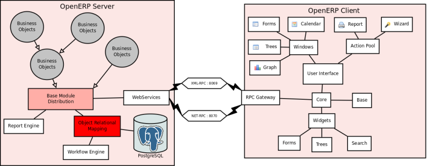

OpenObject Server and Modules
=============================

* **OpenERP** is a `Client/Server <http://en.wikipedia.org/wiki/Client_server>`_ system that works over a IP Network.
* **OpenERP** programming language is Python.
* **OpenERP** uses Object-Oriented technologies.
* **OpenERP** records its data with a PostgreSQL relational database.
* **OpenERP** business objects are modeled with an Object Relational Mapping (ORM) system.
* **OpenERP** offers three Human Machine Interfaces (HMI) a GTK client, a QT client and a web client (eTiny).
* **OpenERP** uses ReportLab for report generation in (PDF).
* **OpenERP** uses XML for several purpose: describing data, view, reports, data transport (XML-RPC) 

Technical Architecture
----------------------

Server/client, XML-RPC
++++++++++++++++++++++

Open ERP is a based on a client/server architecture. The server and the client communicate using the XML-RPC protocol. XML-RPC is a very simple protocol which allows the client to do remote procedure calls. The function called, its arguments, and the result are sent HTTP and encoded using XML.

For more information on XML-RPC, please see: http://www.xml-rpc.com/

Since version 4.2, there is a new protocol between client/server that have been called net-rpc. It is based on the python cPickle function, it is faster than the xml-rpc.

Client
++++++

The logic of Open ERP is entirely on the server side. The client is very simple; his work is to ask data (forms, lists, trees) from the server and to send them back. With this approach, nearly all developments are made on the server side. This makes Open ERP easier to develop and to maintain.

The client doesn't understand what it posts. Even actions like 'Click on the print icon' are sent to the server to ask how to react.

The client operation is very simple; when a user makes an action (save a form, open a menu, print, ...) it sends this action to the server. The server then sends the new action to execute to the client.

There are three types of action;

* Open a window (form or tree)
* Print a document
* Execute a wizard 

Architecture

Explanation of modules:

**Server - Base distribution**

We use a distributed communication mechanism inside the Open ERP server. Our engine support most commonly distributed patterns: request/reply, publish/subscribe, monitoring, triggers/callback, ...

Different business objects can be in different computers or the same objects can be on multiple computers to perform load-balancing on multiple computers.
Server - Object Relational Mapping (ORM)

This layer provides additional object functionality on top of postgresql:

    * Consistency: powerful validity checks,
    * Work with objects (methods, references, ...)
    * Row-level security (per user/group/role)
    * Complex actions on a group of resources
    * Inheritance 

**Server - Web-Services**

The web-service module offer a common interface for all web-services

    * SOAP
    * XML-RPC
    * NET-RPC 

Business objects can also be accessed via the distributed object mechanism. They can all be modified via the client interface with contextual views.

**Server - Workflow Engine**

Workflows are graphs represented by business objects that describe the dynamics of the company. Workflows are also used to track processes that evolve over time.

An example of workflow used in Open ERP:

A sales order generates an invoice and a shipping order

**Server - Report Engine**

Reports in Open ERP can be rendered in different ways:

    * Custom reports: those reports can be directly created via the client interface, no programming required. Those reports are represented by business objects (ir.report.custom)
    * High quality personalized reports using openreport: no programming required but you have to write 2 small XML files:

          - a template which indicates the data you plan to report
          - an XSL:RML stylesheet 
    * Hard coded reports
    * OpenOffice Writer templates 

Nearly all reports are produced in PDF.

**Server - Business Objects**

Almost everything is a business object in Open ERP, they described all data of the program (workflows, invoices, users, customized reports, ...). Business objects are described using the ORM module. They are persistent and can have multiple views (described by the user or automatically calculated).

Business objects are structured in the /module directory.

**Client - Wizards**

Wizards are graphs of actions/windows that the user can perform during a session.

**Client - Widgets**

Widgets are probably, although the origin of the term seems to be very difficult to trace, "WIndow gaDGETS" in the IT world, which mean they are gadgets before anything, which implement elementary features through a portable visual tool.

All common widgets are supported:

    * entries
    * textboxes
    * floating point numbers
    * dates (with calendar)
    * checkboxes
    * ... 

And also all special widgets:

    * buttons that call actions
    * references widgets

          - one2one

          - many2one

          - many2many

          - one2many in list

          - ... 

Widget have different appearances in different views. For example, the date widget in the search dialog represents two normal dates for a range of date (from...to...).

Some widgets may have different representations depending on the context. For example, the one2many widget can be represented as a form with multiple pages or a multi-columns list.

Events on the widgets module are processed with a callback mechanism. A callback mechanism is a process whereby an element defines the type of events he can handle and which methods should be called when this event is triggered. Once the event is triggered, the system knows that the event is bound to a specific method, and calls that method back. Hence callback. 
