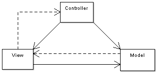
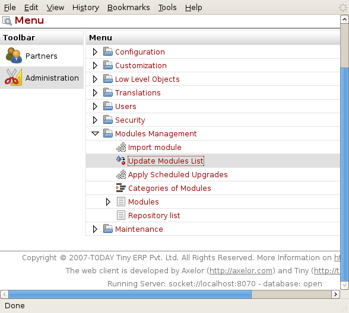
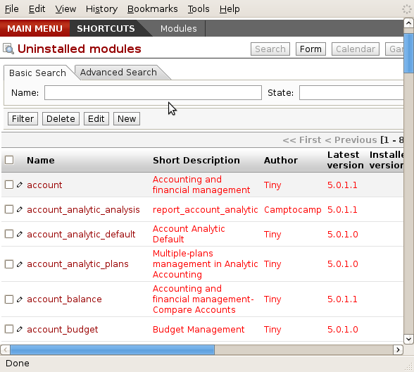
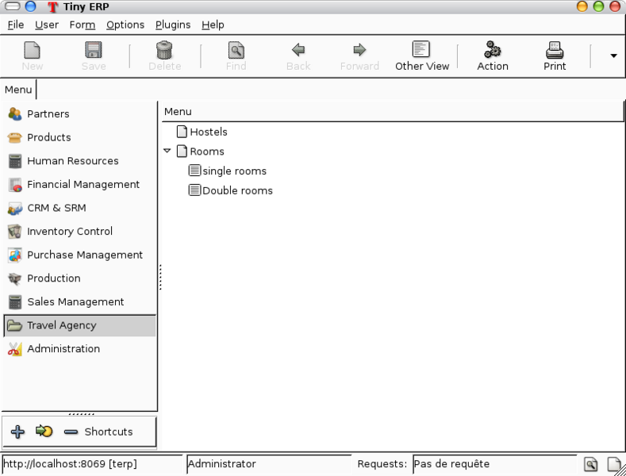
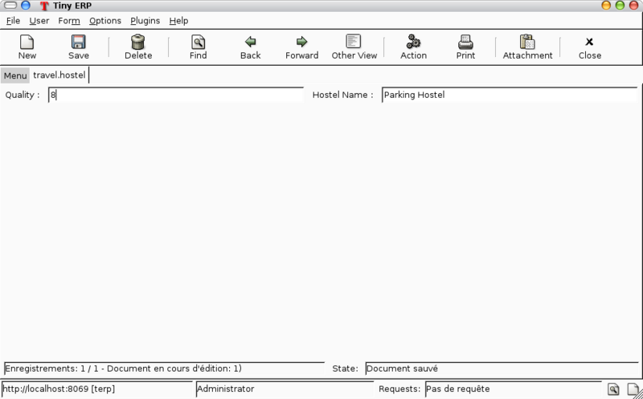

=============================
Rapid Application Development
=============================

Model-View-Controler Architecture
=================================
A Model-view-controller (MVC) is an architectural pattern used in software engineering.

In complex computer applications that present lots of data to the user, one often wishes to separate data (model) and user interface (view) concerns, so that changes to the user interface do not impact the data handling, and that the data can be reorganized without changing the user interface. The model-view-controller solves this problem by decoupling data access and business logic from data presentation and user interaction, by introducing an intermediate component: the controller."

In Tiny ERP, we can apply this model-view-controller semantic with

    * model : The PostgreSQL tables.
    * view : views are defined in XML files in Tiny ERP.
    * controller : The objects of TinyERP. 
    
Creating a module
=================

Creation of objects needed for school management module.
Don't describe everything about objects here, it will be described in detail in the next chapter.

Getting the skeleton directory
------------------------------

Creating a new module is quickly done by copying the module called "simple" or "custom" (depending on your OpenERP version) into a new directory.

As an example on Ubuntu::

        $ cd /usr/lib/tinyerp-server/addons/
        $ sudo cp -r custom travel

You will need to give yourself permissions over that new directory if you want to be able to modify it::

        $ sudo chown -R `whoami` travel

You got yourself the directory for a new module there, and a skeleton structure, but you still need to change a few things inside the module's definition...

Changing the default definition
-------------------------------

To change the default settings of the custom module (which is now the "travel" module), get yourself into the "travel" directory and edit __terp__.py. gedit, in the following example, is just a simple text editor. Feel free to use another one.::

        $ cd travel
        $ gedit __terp__.py

The file looks like this:

.. code-block:: python

        #
        # Use the custom module to put your specific code in a separate module.
        # 
        {
                "name" : "Module for custom developments",
                "version" : "1.0",
                "author" : "Tiny",
                "category" : "Generic Modules/Others",
                "website": "http://www.tinyerp.com",
                "description": "Sample custom module where you can put your customer specific developments.",
                "depends" : ["base"],
                "init_xml" : [],
                "update_xml" : ["custom_view.xml"],
                "active": False,
                "installable": True
        }

You will want to change whichever settings you feel right and get something like this:

.. code-block:: python

        {
                "name" : "Travel agency module",
                "version" : "1.0",
                "author" : "Tiny",
                "category" : "Generic Modules/Others",
                "website": "http://www.tinyerp.com",
                "description": "A module to manage hotel bookings and a few other useful features.",
                "depends" : ["base"],
                "init_xml" : [],
                "update_xml" : ["custom_view.xml"],
                "active": True,
                "installable": True
        }

Note the "active" field becomes true.

Changing the main module file
-----------------------------

Now you need to update the custom.py script to suit the needs of your module. We suggest you follow the Flash tutorial for this or download the travel agency module from the 20 minutes tutorial page.

The documentation below is overlapping the two next step in this wiki tutorial, 
so just consider them as a help and head towards the next two pages first...

The custom.py file should initially look like this (intentionally removing the comments):

.. code-block:: python

        from osv import osv, fields
         
        #class custom_material(osv.osv):
        #       _name = 'network.material'
        #       _inherit = 'network.material'
        #       _columns = {
        #       }
        #       _defaults = {
        #       }
        #custom_material()

The '#' signs represent comments. You'll have to remove them, rename the class and its attributes to something like this:

.. code-block:: python

        from osv import osv, fields
         
        class travel_hostel(osv.osv):
               _name = 'travel.hostel'
               _inherit = 'res.partner'
               _columns = {
                   'rooms_id': fields.one2many('travel.room', 'hostel_id', 'Rooms'),
                   'quality': fields.char('Quality', size=16),
               }
               _defaults = {
               }
        travel_hostel()

Ideally, you would copy that bunch of code several times to create all the entities you need (travel_airport, travel_room, travel_flight). This is what will hold the database structure of your objects, but you don't really need to worry too much about the database side. Just filling this file will create the system structure for you when you install the module.
Customizing the view

Defining the views
==================

You can now move on to editing the views. To do this, edit the custom_view.xml file. It should first look like this:

.. code-block:: xml

        <openerp>
        <data>
                <record model="res.groups" id="group_compta_user">
                        <field name="name">grcompta</field>
                </record>
                <record model="res.groups" id="group_compta_admin">
                        <field name="name">grcomptaadmin</field>
                </record>
                <menuitem name="Administration" groups="admin,grcomptaadmin" icon="terp-stock" id="menu_admin_compta"/>
        </data>
        </openerp>

This is, as you can see, an example taken from an accounting system (French people call accounting "comptabilité", which explains the compta bit).

Defining a view is defining the interfaces the user will get when accessing your module. Just defining a bunch of fields here should already get you started on a complete interface. However, due to the complexity of doing it right, we recommend, once again, that you take a look at the 20 minutes Flash tutorial or download the travel agency module example.

Next you should be able to create different views using other files to separate them from your basic/admin view. 

Adding menus and actions
========================

The file travel_view.xml will first define a menu that calls a basic window that contains fields in which we can edit the content of our database.

.. code-block:: xml

        <openerp>
        <data>
            <record model="ir.actions.act_window" id="action_travel_hostel_form">
                <field name="name">Hostel</field>
                <field name="res_model">travel.hostel</field>
                <field name="view_mode">form,tree</field>
            </record>
            
            <menuitem name="Travel Agency" 
                      id="menu_travel"/>
                      
            <menuitem name="Hostels" 
                      id="menu_travel_hostel_form" 
                      action="action_travel_hostel_form" parent="menu_travel"/>
         
            <record model="ir.actions.act_window" id="action_travel_room_form">
                <field name="name">Room</field>
                <field name="res_model">travel.room</field>
                <field name="view_mode">form,tree</field>
            </record>
            <menuitem name="Rooms" 
                      id="menu_travel_room_form" 
                      action="action_travel_room_form" parent="menu_travel"/>
         
            <record model="ir.actions.act_window" id="action_travel_room_form1">
                <field name="name">Single Rooms</field>
                <field name="res_model">travel.room</field>
                <field name="domain">[('beds','=',1)]</field>
                <field name="view_mode">tree,form</field>
            </record>
            <menuitem name="Single rooms" 
                      id="menu_travel_room_form1" 
                      action="action_travel_room_form1" parent="menu_travel_room_form"/>
         
            <record model="ir.actions.act_window" id="action_travel_room_form2">
                <field name="name">Double Rooms</field>
                <field name="res_model">travel.room</field>
                <field name="domain">[('beds','=',2)]</field>
                <field name="view_mode">tree,form</field>
            </record>
            <menuitem name="Double rooms" 
                      id="menu_travel_room_form2" 
                      action="action_travel_room_form2" parent="menu_travel_room_form"/>
        </data>
        </openerp>

So at this this point, we only defined menus and actions. An action can open a form or a list of object (like in the above example) but can also launch a wizard or a report.

We will then have to install the module in the client. 

Testing the module
==================

The travel agency module prototype can be installed in Tiny ERP client by doing the following in the Modules Management sub menu of the Administration menu of the client :

    * Update Modules List --> Click on Check New Modules 

.. 

    * When the dialog box is closed, double-click on Uninstalled Modules, which will lead you to a window looking like 

.. 

    * If you double-click on travel (our new module), you will see the module form. Click on Install at the bottom.
    * Go back to the main menu and double-click on Apply Upgrades then Start Upgrade. 
Once the module travel is installed into Tiny, the menu looks like :

If we double-click on hostels (that should create a new hostel), this leads to the following view : 

If we don't specify a view, Tiny ERP creates a default view. The default view is rarely nice (except if the fields of the object are very simple), but might be useful in some rare cases for quick testing. Also, the default view specifies no corresponding view for a one2many field. That's why we have no way to see rooms that compose a hostel with the default view.

If we want to change the way the fields are shown on the screen, we need to modify @@travel_view.xml@@, this time to add a view. 

Adding complex views
====================

* gantt : allocation of resources (classes, projectors, ...)
* calendar : manage courses,
* graph : subscriptions, ...

Graphs in views
---------------

A graph is a new mode of view for all views of type form. If, for example, a sale order line must be visible as list or as graph, define it like this in the action that open this sale order line. Do not set the view mode as "tree,form,graph" or "form,graph" - it must be "graph,tree" to show the graph first or "tree,graph" to show the list first. (This view mode is extra to your "form,tree" view and should have a seperate menu item):

 <field name="view_type">form</field>
 <field name="view_mode">tree,graph</field>

Then, the user will be able to switch from one view to the other. Unlike forms and trees, Tiny ERP is not able to automatically create a view on demand for the graph type. So, you must define a view for this graph:

.. code-block:: xml

        <record model="ir.ui.view" id="view_order_line_graph">
           <field name="name">sale.order.line.graph</field>
           <field name="model">sale.order.line</field>
           <field name="type">graph</field>
           <field name="arch" type="xml">
                 <graph string="Sales Order Lines">
                      <field name="product_id" group="True"/>
                      <field name="price_unit" operator="*"/>
                </graph>
            </field>
        </record>

:The graph view:

A view of type graph is just a list of fields for the graph. The default type of the graph is a pie chart - to change it to a barchart change <graph string="Sales Order Lines"> to <graph string="Sales Order Lines" type="bar">

The first field is the X axis. The second one is the Y axis and the optionnal third one is the Z axis for 3 dimensional graphs. You can apply a few attributes to each field/axis:

    * group: if set to true, the client will group all item of the same value for this field. For each other field, it will apply an operator
    * operator: the operator to apply is another field is grouped. By default it's '+'. Allowed values are:
          - +: addition
          - *: multiply
          - **: exponent
          - min: minimum of the list
          - max: maximum of the list 

:Defining real statistics on objects:

The easiest method to compute real statistics on objects is:

   1. Define a statistic object wich is a postgresql view
   2. Create a tree view and a graph view on this object 

You can get en example in all modules of the form: report_.... Example: report_crm. 

Defining the process
====================

Thourgh the interface and module recorder
Then, put the generated XML in your own module

