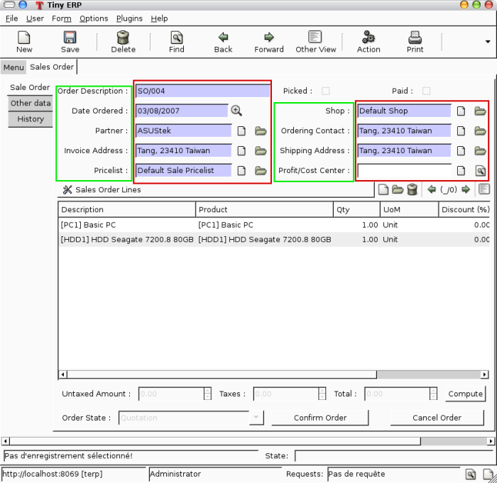
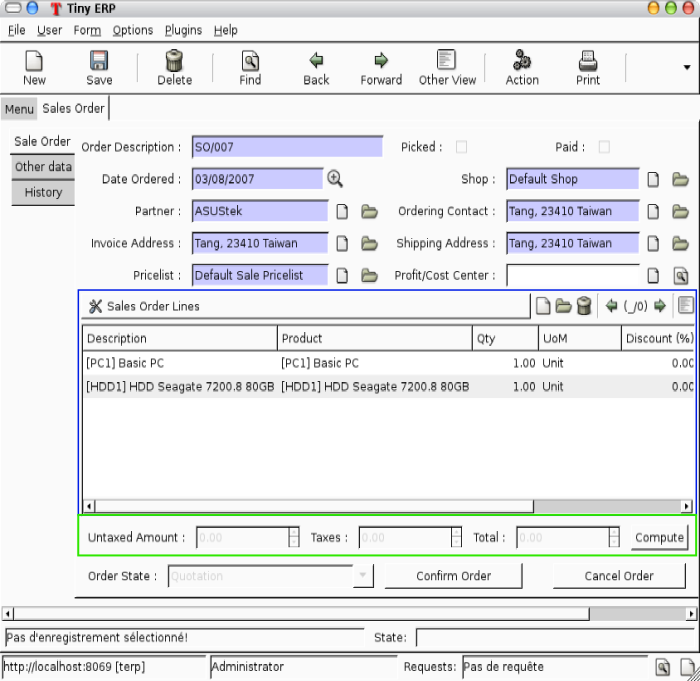
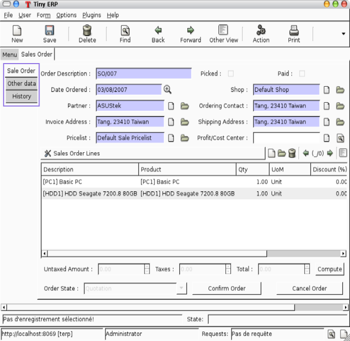
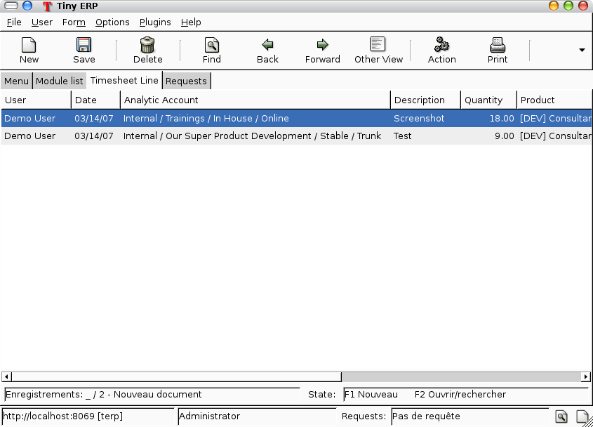

=================
Creation of Views
=================

Introduction
============

As all data of the program is stored in objects, as explained in the Objects section, how are these objects exposed to the user ? We will try to answer this question in this section.

First of all, let's note that every resource type uses its own interface. For example, the screen to modify a partner's data is not the same as the one to modify an invoice.

Then, you have to know that the Open ERP user interface is dynamic, it means that it is not described "statically" by some code, but dynamically built from XML descriptions of the client screens.

From now on, we will call these screen descriptions views.

A notable characteristic of these views is that they can be edited at any moment (even during the program execution). After a modification to a displayed view has occurred, you simply need to close the tab corresponding to that 'view' and re-open it for the changes to appear.

Views principles
----------------

Views describe how each object (type of resource) is displayed. More precisely, for each object, we can define one (or several) view(s) to describe which fields should be drawn and how.

There are two types of views:

#. form views
#. tree views 

.. note::

	Since Open ERP 4.1, form views can also contain graphs.

Form views
++++++++++

The field disposition in a form view always follows the same principle. Fields are distributed on the screen following the rules below:

    * By default, each field is preceded by a label, with its name.
    * Fields are placed on the screen from left to right, and from top to bottom, according to the order in which they are declared in the view.
    * Every screen is divided into 4 columns, each column being able to contain either a label, or an "edition" field. As every edition field is preceded (by default) by a label with its name, there will be two fields (and their respective labels) on each line of the screen. The green and red zones on the screen-shot below, illustrate those 4 columns. They designate respectively the labels and their corresponding fields. 

Views also support more advanced placement options:
""""""""""""""""""""""""""""""""""""""""""""""""""

    * A view field can use several columns. For example, on the screen-shot below, the zone in the blue frame is, in fact, the only field of a "one to many". We will come back later on this note, but let's note that it uses the whole width of the screen and not only one column. 

    * We can also make the opposite operation: take a columns group and divide it in as many columns as desired. The surrounded green zones of the screen above are good examples. Precisely, the green framework up and on the right side takes the place of two columns, but contains 4 columns. 

As we can see below in the purple zone of the screen, there is also a way to distribute the fields of an object on different tabs.

Tree views
+++++++++++

These views are used when we work in list mode (in order to visualize several resources at once) and in the search screen. These views are simpler than the form views and thus have less options.

Inheritancies of views
======================

Introduction
------------
When you create and inherit objects in some custom or specific modules, it is better to inherit (than to replace) from an existing view to add/modify/delete some fields and preserve the others.

Inheriting a view
-----------------

Example:

.. code-block:: xml

	<record model="ir.ui.view" id="view_partner_form">
	    <field name="name">res.partner.form.inherit</field>
	    <field name="model">res.partner</field>
	    <field name="inherit_id" ref="base.view_partner_form"/>
	    <field name="arch" type="xml">
		 <notebook position="inside">
		     <page string="Relations">
		           <field name="relation_ids" colspan="4" nolabel="1"/>
		     </page>
		 </notebook>
	    </field>
	</record>

The inheritance engine will parse the existing view and search for the the root nodes of::

	<field name="arch" type="xml">

It will append or edit the content of this tag. If this tag has some attributes, it will look for the matching node, including the same attributes (unless position).

This will add a page to the **notebook** of the **res.partner.form** view in the base module.

You can use these values in the position attribute:

    * **inside** (default): your values will be appended inside this tag
    * **after**: add the content after this tag
    * **before**: add the content before this tag
    * **replace**: replace the content of the tag. 

Second Example:

.. code-block:: xml
	<record model="ir.ui.view" id="view_partner_form">
	    <field name="name">res.partner.form.inherit</field>
	    <field name="model">res.partner</field>
	    <field name="inherit_id" ref="base.view_partner_form"/>
	    <field name="arch" type="xml">
		 <page string="Extra Info" position="replace">
		     <field name="relation_ids" colspan="4" nolabel="1"/>
		 </page>
	    </field>
	</record>

Will replace the content of the **Extra Info** tab of the notebook by one 'relation_ids' field.

The parent and the inherited views are correctly updated with **--update=all** argument like any other views.

To **delete a field from a form**, an empty element with position="replace" atribute is used. Example:

.. code-block:: xml

	<record model="ir.ui.view" id="view_partner_form3">
	    <field name="name">res.partner.form.inherit</field>
	    <field name="model">res.partner</field>
	    <field name="inherit_id" ref="base.view_partner_form"/>
	    <field name="arch" type="xml">
		 <field name="lang" position="replace"/>
	   </field>
	</record>

Take into account that only one position="replace" attribute can be used per inherited view so multiple inherited views must be created to make multiple replacements. 

Improvement of school management module
=======================================

Remaining As of no idea about it.

Improvement of screens
----------------------

Remaining As of no idea about it.

Adding some attrs
-----------------

Remaining As of no idea about it.

