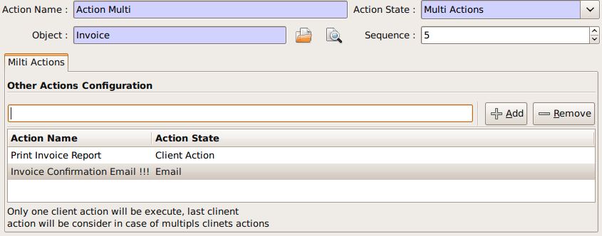
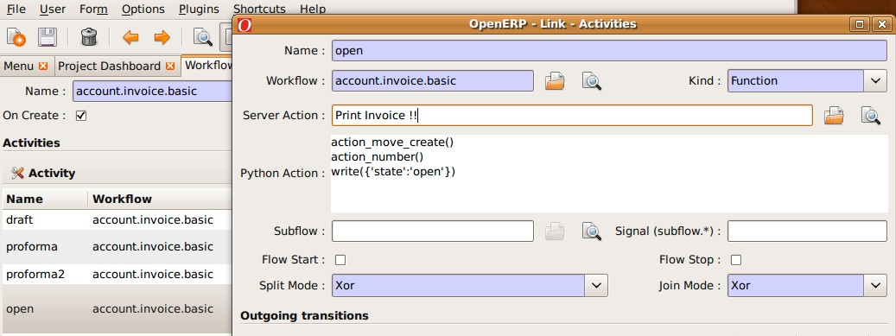

Server Action
=============

Introduction
------------
Server action is an new feature to the OpenERP available since the version 5.0 beta, This is the
interesting features for the customizer, to full fill the customers requirements, This features enables
to provides the quick and easy configuration some process which is day to day requirements. Like
send email on confirmation of the sale order, or confirmation of the Invoice, log the operation of
the invoice (confirm, cancel, etc..). or need to develope some system which runs wizard / report on
the confirmation of the sales, purchase, or invoice. So Server action is the only one answer to solve
all this kind of problems without doing any development, just a few configuration and the system is
ready to answer few of above questions.

Following are the list of action types which are supplied under the Server Action.

       * Client Action
       * Trigger
       * Email
       * SMS
       * Create Object
       * Write Object
       * Multi Action

Each type of action have the special features and different configuration parameters. We will see
one by one all type of action how to configure and list of parameters that affect the system

Client Action
-------------

This action executes at client side, this is a good idea to run the wizard or report at client side.
Using this type of action we can make the system like ERP will print the invoice after confirmation
of the Invoice. Like it will run the payment wizard after confirmation of the invoice. Technically we
can run all client action which execute at client side. We can execute ir.actions.report.custom,
ir.actions.report.xml, ir.actions.act_window, ir.actions.wizard, or ir.actions.url. Here is an example
to show how we can configuration Client action to print the invoice after confirmation of the
invoice.

.. image:: images/client_action.png

This is an good and seems easy to configure the action.

Important fields are

:Object: Select the object on which we want to implement the Server Action when work flow will execute on this object
:Client Action: Select the client action that is to execute at client side. Any of the following types.

* ir.actions.report.custom
* ir.actions.report.xml
* ir.actions.act_window
* ir.actions.wizard
* ir.actions.url

Trigger
-------

Trigger is an really excellent when we want to deal with the work flow of the other object which
working the work flow of the first object. For example we want to configure the system like when
we confirm the purchase order and create the invoice that newly created invoice should confirm it
self automatically by the server action.

.. image:: images/trigger_action.png

This is the easy configuration for the trigger to have the system where the created invoice will
confirm it self.

Important fields are

:Object: Select the object on which we want to implement the Server Action when work flow will execute on this object

:Work-flow on: Here we select invoice, need to select the model on which the automatic workflow will be called by the action system

:Trigger On: We need to provide the id of the newly record, here in this case, Purchase order store the id of the Invoice after creating of the invoice in invoice_id field.

:Trigger Name: This is the signal name which we want to generate on the newly created object.

Email Action
------------

This is the common requirement for all business process, like send the confirmation by the email
when sales order, purchase order, invoice, payment, shipping of goods will takes place. For that we
need only few things to configure and tiny will send the email very quickly and in easy way. Even
not need to setting up the your own email server, you can use your exciting email server and
account, of you not have your email server you can use from the free email account by Gmail,
Yahoo !, etc..

*Server Configuration*

supply the following parameters when we run OpenERP Server.

::

  --email-from=gajjarmantavya@yahoo.co.in user email address
  --smtp=smtp.mail.yahoo.co.in smtp server name or ip
  --smtp-port=587 smtp port
  --smtp-user=gajjarmantavya user name usually same as the email address name without domain name
  --smtp-password=************* password to the user account
  --smtp-ssl=False use in case if the server required ssl for sending email

.. **

Email Action Configuration

.. image:: images/email_action.png

Important Fields are

:Object: Select the object on which we want to implement the Server Action when work flow will execute on this object
:Contact: We need to select the fields from which action will select the email address to whom we would like to send the email, system will display all the fields related to the current object selected in the Object field
:Message: You can provide the message template with the fields that related to the current object. And it will be merge when it is going to send the email. This is the same language then the rml which is used to design the report here we can use the [[ ]] + html tage to design in the html format Working with You can select the any fields from the current object, like here we select the [[ ]] invoice in the object.

For example to get the partner name we can use [[ object.partner_id.name ]]like the same, object refers to the current object and we can access any fields which exist in the model.

After confirmation the invoice we get the confirmation email from the action.

.. 	:: images/email_confirm.png

Create Object
-------------

This is an interesting feature for the tiny partners those who want to track the transaction in the
OpenERP, like currently in the ERP you can get the Event history on the Partners which logs the
only the sales order events. But if we want to start logging the invoice like the same we can easily
do like that using the Create object Actions.

.. image:: images/create_object.png

Create Object action have the easy but tricky configuration, for the movement you have to
remember the fields name or check it out from the code it self, in future we will develop the
expression builder inside OpenERP so you can build the complex expression.

Important fields are

:Object: Select the object on which we want to implement the Server Action when work flow will execute on this object
:Model: This is the target model where the new object is to be created, if its empty it refers to the current object and allow to select the fields from the same, but its advisable to provide the model in all case if different or if the same.
:Fields Mapping: Need to provide the 3 values

1. Field: any of the fields from the target model
2. type of the value you can give either value or expression
3. provide the value or expression the expression again start with the 'object' keyword and its refers to the current object which selected in to the Object field.

*You must select the all required fields from the object*

:Record Id: After creating the new record where the id of the new record if going to store. So in future we can refer the same for the other operations.

Write Object
------------

The same configuration as defined for the Create Object, here we take an example that it will write the
'Additional Information' on the same object

.. image:: images/write_object.png

Important Fields are

  **same as the Create Object**

Multi Action
------------

This is the most interesting action, which allows to execute the multiple server action on the same
business operations. Like if you want to print and send the email on confirmation of the invoice. We
need to create the 3 Server Actions for that.

  * Print Invoice
  * Invoice Confirmation Email !!
  * Multi Action

The only problem with the Multi Action is that it will execute many actions at the server side, but only
one client action will be executed.

For example we would like to print report + execute the wizard this 2 operation is not allowd in the
one multi action.

Important Fields are

:Object: Select the object on which we want to implement the Server Action when work flow will execute on this object
:Other Actions: We need to select the server action in this fields, we are free to select the as many as actions as we can. Just we need to take care for the problem of the multi action, other things is very easy.

**Link it up with the Work flow**

The important things is to link the server action with the work flow, its bit easy to link with action
with the work flow. Open the work flow editor in GTK, select the work flow and go to the start and
select the Sever Action. This will automatically be called when the object comes to that state.

Here in this example I added the Action to print the Invoice, when the Invoice will be confirmed.

