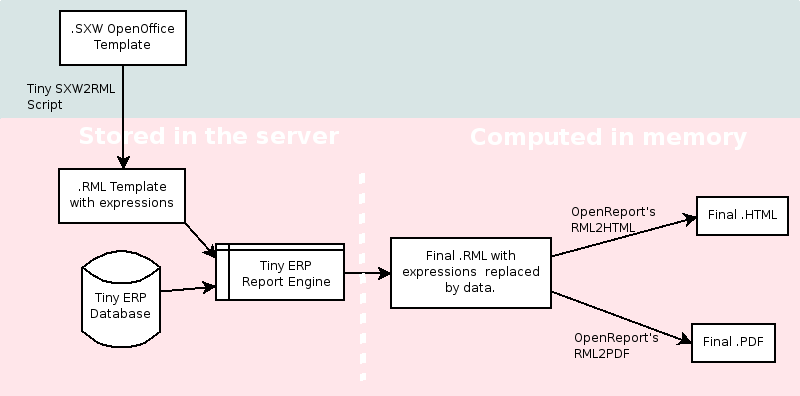

=================================
Creation of Reports (The Reports)
=================================

Introduction
============

This chapter is dedicated to detailed objects definition:

* reports

* rml-reports

* report designer tools

* xml-xslt reports

There are mainly ''three types'' of reports in Open ERP:

#. OpenOffice.org reports
#. RML reports
#. Custom reports (based on PostgreSQL views and displayed within the interface)

Open Office - Designer
======================

.. Explain to design Report without Plugins, and then translate using the tiny_sxw2rml translator

OpenOffice.org reports are the most commonly used report formats. OpenOffice.org Writer is used to generate a RML template, which in turn is used to generate a pdf printable report.

.. image:: images/ooo_report_overview.png

:The internal process:

:The .SXW template file:

    * We use a .SXW file for the template, which is the OpenOffice 1.0 format. The template includes expressions in brackets or OpenOffice fields to point where the data from the Open ERP server will be filled in. This document is only used for developers, as a help-tool to easily generate the .RML file. Open ERP does not need this .SXW file to print reports.

:The .RML template:

    * We generate a .RML file from the .SXW file using Open SXW2RML. A .RML file is a XML format that represent a .PDF document. It can be converted to a .PDF after. We use RML for more easy processing: XML syntax seems to be more common than PDF syntax.

:The report engine:

    * The Open Report Engine process the .RML file inserting data from the database at each expression. For example, something like [= o.partner_id.country_id.name =]

in the .RML file will be replaced by the name of the country of the partner of the printed invoice. This report engine produce the same .RML file where all expressions have been replaced by real data.
The final document

    * Finaly the .RML file is converted to PDF or HTML according to the need, using OpenReport's scripts.

Introduction
------------

In order to create a report, the general idea is to

* Declare a report in a XML file that must be added in the update_xml section of the __terp__.py file.
* Create a report model with OpenOffice.org writer, convert it to RML using Open sxw2rml (which can be downloaded here).
* Optionally declare a custom parser in order to be able to use more functions than the functions provided by the default parser. We won't detail this third step here and only use the automatic parser.

* The XML file that declares the report will be named travel_report.xml in the folder travel and will contain

.. code-block:: xml

        <openerp>
           <data>
                 <report id="travel_agency_room_booking_tickets"
                      string="Room Booking Tickets"
                      model="travel.room"
                      name="travel_agency_room_booking_tickets_report"
                      rml="travel/report/tickets.rml"
                      auto="True"/>
           </data>
        </openerp>

* As travel_report.xml also needs to be loaded, we modify the file __terp__.py so that the information associated with update_xml is now ['travel_view.xml', 'travel_report.xml'].
* We create a report subfolder in the travel folder. This folder must contain the file tickets.rml.Open Office writer will first be used to create tickets.sxw.

::

        $ cd ~/openerp/server/bin/addons/travel
        $ mkdir report
        $ cd report
        $ oowriter &

Access Objects and Fields
-------------------------

* In **Open Office writer**, we insert a new section inside which we create a 2x2 table, and type the same Python code, inside double brackets, as shown in the screenshot below :

.. image:: images/OOoReportModel.png

The model must be saved as sxw !

To carry trhough the next steps you will need to download and to untar `Open Report`_:

.. _Open Report: http://tinyforge.org/projects/tinyreport/

* In tiny_sxw2rml script folder, we do the following::

        ~/tiny_sxw2rml$ ./tiny_sxw2rml.py ~/openerp/server/bin/addons/travel/report/tickets.sxw > ~/openerp/server/bin/addons/travel/report/tickets.rml

        .. note::
                sxw2rml always outputs rml data on the screen or an error message. So it could be wise to check that the path to your sxw is correct and that sxw2rml can read it correctly before redirecting stdout (and possibly overwriting an old working rml).

* We restart the server and ask to update the travel module::

        ~/openerp/server/bin$ ./openerp-server.py --database=terp --update=travel

We should have a report installed. Here is an example with two rooms booked in two different hostels

.. image:: images/HostelOfTheBeach_report.png

Registering Report
------------------

To generate the pdf from the rml file, OpenERP needs a rml parser.
Parser

The parsers are generally put into the folder report of the module. Here is the code for the sale order report:

.. code-block:: python

  import time
  from report import report_sxw

  class order(report_sxw.rml_parse):
    def __init__(self, cr, uid, name, context):
      super(order, self).__init__(cr, uid, name, context)
      self.localcontext.update({
      'time': time,
      })

  report_sxw.report_sxw('report.sale.order', 'sale.order', 'addons/sale/report/order.rml', parser=order, header=True)

The parser inherit from the report_sxw.rml_parse object and it add to the localcontext, the function time so it will be possible to call it in the report.

After an instance of report_sxw.report_sxw is created with the parameters:

    * the name of the report
    * the object name on which the report is defined
    * the path to the rml file
    * the parser to use for the report (by default rml_parse)
    * a boolean to add or not the company header on the report (default True)

:The xml definition:

To be visible from the client, the report must be declared in an xml file (generally: "module_name"_report.xml) that must be put in the __terp__.py file

Here is an example for the sale order report:

.. code-block:: xml

  <?xml version="1.0"?>
  <openerp>
    <data>
      <report
           id="report_sale_order"
           string="Print Order"
           model="sale.order"
           name="sale.order"
           rml="sale/report/order.rml"
           auto="False"/>
           header="False"/>
     </data>
  </openerp>

The arguments are:

    * id: the id of the report like any xml tag in OpenERP
    * string: the string that will be display on the Client button
    * model: the object on which the report will run
    * name: the name of the report without the first "report."
    * rml: the path to the rml file
    * auto: boolean to specify if the server must generate a default parser or not
    * header: allows to enable or disable the report header located in "[server_dir]/bin/addons/custom"

Design Complex Report
======================

**Remaining**

Introduction
------------

Sections
--------

Loops / Tables
---------------

Expressions
-----------

Custom Parser
-------------

.. tip::   **Important**  *Print Multiple Copies of Report.*

Tiny API in Reports - Functions
-------------------------------

XML-XSLT Report
---------------

RML reports don't require programming but require two simple XML files to be written:

  * a file describing the data to export (\*.xml)
  * a file containing the presentation rules to apply to that data (\*.xsl)

.. *

.. image:: images/Automatic-reports.png

The role of the XML template is to describe which fields of the resource have to be exported (by the server). The XSL:RML style sheet deals with the layout of the exported data as well as the "static text" of reports. Static text is referring to the text which is common to all reports of the same type (for example, the title of table columns).
Example

Here is, as an example, the different files for the simplest report in the ERP.

.. image:: images/ids-report.png

XML Template

.. code-block:: xml

        <?xml version="1.0"?>

            <ids>
            <id type="fields" name="id">

                <name type="field" name="name"/>
                <ref type="field" name="ref"/>

            </id>
            </ids>

XML data file (generated)

.. code-block:: xml

        <?xml version="1.0"?>

            <ids>
            <id>

                <name>Tiny sprl</name>
                <ref>pnk00</ref>

            </id><id>

                <name>ASUS</name>
                <ref></ref>

            </id><id>

                <name>Agrolait</name>
                <ref></ref>

            </id><id>

                <name>Banque Plein-Aux-As</name>
                <ref></ref>

            </id><id>

                <name>China Export</name>
                <ref></ref>

            </id><id>

                <name>Ditrib PC</name>
                <ref></ref>

            </id><id>

                <name>Ecole de Commerce de Liege</name>
                <ref></ref>

            </id><id>

                <name>Elec Import</name>
                <ref></ref>

            </id><id>

                <name>Maxtor</name>
                <ref></ref>

            </id><id>

                <name>Mediapole SPRL</name>
                <ref></ref>

            </id><id>

                <name>Opensides sprl</name>
                <ref>os</ref>

            </id><id>

                <name>Tecsas sarl</name>
                <ref></ref>

            </id>
            </ids>

XSL stylesheet

.. code-block:: xml

        <?xml version="1.0" encoding="utf-8"?> <xsl:stylesheet version="1.0" xmlns:xsl="http://www.w3.org/1999/XSL/Transform" xmlns:fo="http://www.w3.org/1999/XSL/Format">

            <xsl:template match="/">

                <xsl:apply-templates select="ids"/>

            </xsl:template>

            <xsl:template match="ids">

                <document>

                    <template pageSize="21cm,29.7cm">

                        <pageTemplate>

                            <frame id="col1" x1="2cm" y1="2.4cm" width="8cm" height="26cm"/>
                            <frame id="col2" x1="11cm" y1="2.4cm" width="8cm" height="26cm"/>

                        </pageTemplate>

                    </template>

                <stylesheet>

                    <blockTableStyle id="ids">

                        <blockFont name="Helvetica-BoldOblique" size="12" start="0,0" stop="-1,0"/>
                        <lineStyle kind="BOX" colorName="black" start="0,0" stop="-1,0"/>

                        <lineStyle kind="BOX" colorName="black" start="0,0" stop="-1,-1"/>

                    </blockTableStyle>

                </stylesheet>

                <story>

                    <blockTable colWidths="2cm, 6cm" repeatRows="1" style="ids">

                        <tr>

                            <td t="1">Ref.</td>
                            <td t="1">Name</td>

                        </tr>
                        <xsl:apply-templates select="id"/>

                    </blockTable>

                </story>
                </document>

            </xsl:template>

            <xsl:template match="id">

                <tr>

                    <td><xsl:value-of select="ref"/></td>
                    <td><para><xsl:value-of select="name"/></para></td>

                </tr>

            </xsl:template>
            </xsl:stylesheet>

Resulting RML file (generated)

.. code-block:: xml

        <?xml version="1.0"?>

            <document>
            ...

                <story>

                    <blockTable colWidths="2cm, 6cm" repeatRows="1" style="ids">

                        <tr>

                            <td t="1">Ref.</td>
                            <td t="1">Name</td>

                        </tr>
                        <tr>

                            <td>pnk00</td>
                            <td><para>Tiny sprl</para></td>

                        </tr>
                        <tr>

                            <td></td>
                            <td><para>ASUS</para></td>

                        </tr>
                        <tr>

                            <td></td>
                            <td><para>Agrolait</para></td>

                        </tr>
                        <tr>

                            <td></td>
                            <td><para>Banque Plein-Aux-As</para></td>

                        </tr>
                        <tr>

                            <td></td>
                            <td><para>China Export</para></td>

                        </tr>
                        <tr>

                            <td></td>
                            <td><para>Ditrib PC</para></td>

                        </tr>
                        <tr>

                            <td></td>
                            <td><para>Ecole de Commerce de Liege</para></td>

                        </tr>
                        <tr>

                            <td></td>
                            <td><para>Elec Import</para></td>

                        </tr>
                        <tr>

                            <td></td>
                            <td><para>Maxtor</para></td>

                        </tr>
                        <tr>

                            <td></td>
                            <td><para>Mediapole SPRL</para></td>

                        </tr>
                        <tr>

                            <td>os</td>
                            <td><para>Opensides sprl</para></td>

                        </tr>
                        <tr>
                        <td></td>

                            <td><para>Tecsas sarl</para></td>

                        </tr>

                    </blockTable>

                </story>

            </document>

Fore more information on the formats used:

    * RML : http://reportlab.com/docs/RML_UserGuide_1_0.pdf
    * XSL - Specification : http://www.w3.org/TR/xslt
    * XSL - Tutorial : http://www.zvon.org/xxl/XSLTutorial/Books/Output/contents.html

All these formats use XML:

    * http://www.w3.org/XML/

..        Improvement of school management module
        =======================================

        Adding reports
        --------------

        Adding upgrade reports
        ----------------------

OpenOffice Report Designer
==========================

Select Tiny Report > Server parameters or Open ERP Report > Server parameters in the top menu of OpenOffice.org Writer. You can then enter your connection parameters to the Open ERP server. You must select a database \ ``demo_min``\   in which you've already installed the module \ ``sale``\  . A message appears if you've made a successful connection.

.. index::
   single: Report; Modify
..

Modifying a report
-------------------

The report editor lets you:

* modify existing reports which will then replace the originals in your Open ERP database,

* create new reports for the selected object.

To modify an existing report, select  *Tiny Report > Modify Existing Report* . Choose the report \ ``Request for Quotation``\   in the  *Modify Existing Report*  dialog box and then click  *Save to Temp Directory* .

.. image::  images/openoffice_quotation.png
   :align: center

*Modifying a document template*

OpenOffice.org then opens the report in edit mode for you. You can modify it using the standard word processing functions of OpenOffice.org Writer.

The document is modified in its English version. It will be translated as usual by Open ERP's translation system when you use it through the client interface, if you've personalized your own setup to translate to another language for you. So you only need to modify the template once, even if your system uses other languages – but you'll need to add translations as described earlier in this chapter if you add fields or change the content of the existing ones.

.. tip::   **Attention**  *Older reports*

The older reports haven't all been converted into the new form supported by Open ERP. The data expressions in the old format are shown within double brackets and not in OpenOffice.org fields.

You can transform an old report format to the new format from the OpenOffice.org menu Tiny Report > Convert Bracket–Fields.

From the Tiny toolbar in OpenOffice.org it's possible to:

* connect to the Open ERP server: by supplying the connection parameters.

* add a loop: select a related field amongst the available fields from the proposed object, for example \ ``Order lines``\  . When it's printed this loop will be run for each line of the order. The loop can be put into a table (the lines will then be repeated) or into an OpenOffice.org section.

* add a field: you can then go through the whole Open ERP database from the selected object and then a particular field.

* add an expression: enter an expression in the Python language to calculate values from any fields in the selected object.

.. tip::   **Technique**  *Python Expressions*

Using the Expression button you can enter expressions in the Python language. These expressions can use all of the object's fields for their calculations.

For example if you make a report on an order you can use the following expression:

.. code-block:: python

  '%.2f' % (amount_total * 0.9,)

.. *

In this example, amount_total is a field from the order object. The result will be 90% of the total of the order, formatted to two decimal places.

 *Tiny Report > Send to server*  *Technical Name*  *Report Name* \ ``Sale Order Mod``\   *Corporate Header*  *Send Report to Server*

You can check the result in Open ERP using the menu  *Sales Management > Sales Orders > All Orders* .

.. index::
   single: Report; New
..

Creating a new report
---------------------

 *Tiny Report > Open a new report* \ ``Sale Order``\   *Open New Report*  *Use Model in Report*

The general template is made up of loops (such as the list of selected orders) and fields from the object, which can also be looped. Format them to your requirements then save the template.

The existing report templates make up a rich source of examples. You can start by adding the loops and several fields to create a minimal template.

When the report has been created, send it to the server by clicking  *Tiny Report > Send to server* , which brings up the  *Send to server*  dialog box. Enter the  *Technical Name*  of \ ``sale.order``\  , to make it appear beside the other sales order reports. Rename the template as \ ``Sale Order New``\   in  *Report Name* , check the checkbox  *Corporate Header*  and finally click  *Send Report to Server* .

To send it to the server, you can specify if you prefer Open ERP to produce a PDF when the user prints the document, or if Open ERP should open the document for editing in OpenOffice.org Writer before printing. To do that choose \ ``PDF``\   or \ ``SXW``\   (a format of OpenOffice.org documents) in the field  *Select Report Type*

Open ERP objects can be created from PostgreSQL views. The technique is as follows :

   1. Declare your _columns dictionary. All fields must have the flag readonly=True.
   2. Specify the parameter _auto=False to the Open ERP object, so no table corresponding to the _columns dictionnary is created automatically.
   3. Add a method init(self, cr) that creates a PostgreSQL View matching the fields declared in _columns. 

Example The object report_crm_case_user follows this model.

.. code-block:: python

        report_crm_case_user(osv.osv):
             _name = "report.crm.case.user"
             _description = "Cases by user and section"
             _auto = False
             _columns = {
                'name': fields.date('Month', readonly=True),
                'user_id':fields.many2one('res.users', 'User', readonly=True, relate=True),
                'section_id':fields.many2one('crm.case.section', 'Section', readonly=True, relate=True),
                'amount_revenue': fields.float('Est.Revenue', readonly=True),
               'amount_costs': fields.float('Est.Cost', readonly=True),
                'amount_revenue_prob': fields.float('Est. Rev*Prob.', readonly=True),
                'nbr': fields.integer('# of Cases', readonly=True),
               'probability': fields.float('Avg. Probability', readonly=True),
                'state': fields.selection(AVAILABLE_STATES, 'State', size=16, readonly=True),
                'delay_close': fields.integer('Delay to close', readonly=True),
            }
             _order = 'name desc, user_id, section_id'
         
            def init(self, cr):
                cr.execute("""
                     create or replace view report_crm_case_user as (
                         select
                             min(c.id) as id,
                             substring(c.create_date for 7)||'-01' as name,
                             c.state,
                             c.user_id,
                             c.section_id,
                             count(*) as nbr,
                             sum(planned_revenue) as amount_revenue,
                             sum(planned_cost) as amount_costs,
                             sum(planned_revenue*probability)::decimal(16,2) as amount_revenue_prob,
                             avg(probability)::decimal(16,2) as probability,
                             to_char(avg(date_closed-c.create_date), 'DD"d" `HH24:MI:SS') as delay_close
                         from
                             crm_case c
                         group by substring(c.create_date for 7), c.state, c.user_id, c.section_id
                )""")
        report_crm_case_user()

