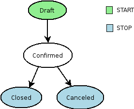
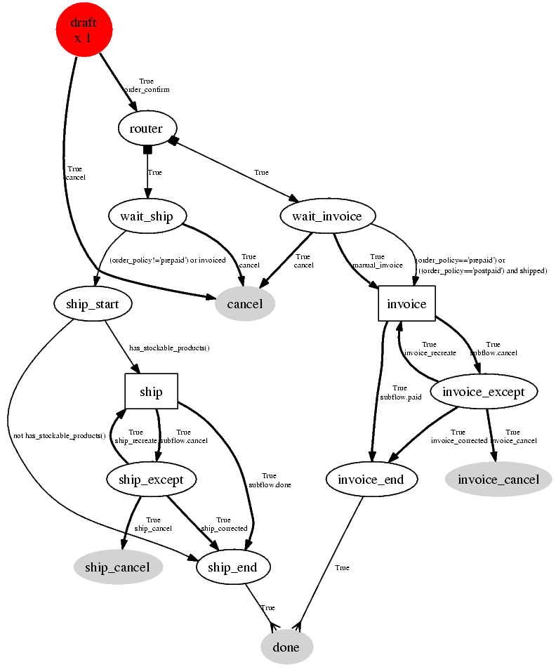
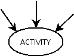
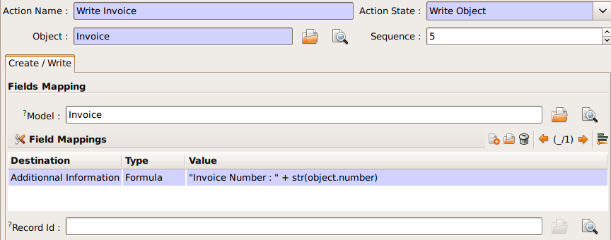

===============================
Business Process (The Workflow)
===============================

Introduction
============

The workflow system in Open ERP is a very powerful mechanism that can describe the evolution of documents (model) in time.

Workflows are entirely customizable, they can be adapted to the flows and trade logic of almost any company. The workflow system makes Tiny ERP very flexible and allows it to easily support changing needs without having to program new functionalities.

Goals
-----

    * description of document evolution in time
    * automatic trigger of actions if some conditions are met
    * management of company roles and validation steps
    * management of interactions between the different objects/modules
    * graphical tool for visualization of document flows

To understand its utility, see these three examples:
----------------------------------------------------

WkfExample1: Discount On Orders

The first diagram represent a very basic workflow of an order:

The order starts in the 'draft' state, when it is in redaction and not approved. When the user press on the 'Confirm' button, the invoice is created and the order comes into the 'CONFIRMED' state.

Then, two operations are possible:

#. the order is done (shipped)

#. the order is canceled

Let's suppose a company has a need not implemented in TinyERP. For example, suppose their sales staff can only offer discounts of 15% or less. Every order having a discount above 15% must be approved by the sales manager.

This modification in the sale logic doesn't need any line of python code! A simple modification of the workflow allows us to take this new need into account and add the extra validation step.

.. image:: images/Workflow_bc2.png

The workflow is thus modified as above and the orders will react as we want to. We then only need to modify the order form view and add a validation button at the desired location.

We could then further improve this workflow by sending a request to the sales manager when an order enters the 'Validation' state. Workflow nodes can execute object methods; only two lines of Python are needed to send a request asking the sales manager to validate or not the order.

WkfExample2: A sale order that generates an invoice and a shipping order.

WkfExample3: Acount invoice basic workflow

.. image:: images/Acount_inv_wkf.jpg

Defining Workflow
=================
Workflows are defined in the file server/bin/addons/base/ir/workflow/workflow.py. The first three classes defined in this file are workflow, wkf_activity and wkf_transition. They correspond to the three types of resources that are necessary to describe a workflow :

    * workflow: the workflow,
    * wkf_activity: the activities (nodes),
    * wkf_transition: the transitions between the activities.

General structure of a workflow XML file
========================================

The general structure of a workflow XML file is as follows :

.. code-block:: xml

    <?xml version="1.0"?>
    <terp>
    <data>
    <record model="workflow" id=workflow_id>

        <field name="name">workflow.name</field>
        <field name="osv">resource.model</field>
        <field name="on_create">True | False</field>

    </record>

    </data>
    </terp>

Where

    * **id** (here "workflow_id") is a workflow identifier. Each workflow must have an unique identifier.
    * **name** (here "workflow.name") is the name of the workflow. The name of the workflow must respect the Open ERP syntax of "dotted names".
    * **osv** (here "resource.model") is the name of the Tiny object we use as a model [-(Remember a Open object inherits from osv.osv, hence the '<field name="osv">')-].
    * **on_create** is True if workflow.name must be instantiated automatically when resource.model is created, and False otherwise.

Example

The workflow **"sale.order.basic"** defined in addons/sale/sale_workflow.xml follows exactly this model, the code of its workflow tag is :

.. code-block:: xml

    <record model="workflow" id="wkf_sale">

        <field name="name">sale.order.basic</field>
        <field name="osv">sale.order</field>
        <field name="on_create">True</field>

    </record>

Activity
==========

Introduction
============

The wkf_activity class represents the nodes of workflows. These nodes are the actions to be executed.

The fields
----------

split_mode
----------

.. image::  images/Wkf_split.png

* XOR: One necessary transition, takes the first one found (default).
* OR : Take only valid transitions (0 or more) in sequential order.
* AND: All valid transitions are launched at the same time (fork).

In the OR and AND separation mode, certain workitems can be generated.

In the AND mode, the activity waits for all transitions to be valid, even if some of them are already valid. They are all triggered at the same time.
join_mode
join_mode:

* **XOR**: One transition necessary to continue to the destination activity (default).
* **AND**: Waits for all transition conditions to be valid to execute the destination activity.

kind:
-----

:The type of the activity can take several values:

    * **DUMMY**: Do nothing (default).
    * **FUNCTION**: Execute the function selected by an action.
    * **SUBFLOW**: Execute a sub-workflow SUBFLOW_ID. The action method must return the ID of the concerned resource by the subflow ! If the action returns False, the workitem disappears !
    * **STOPALL**:

A sub-workflow is executed when an activity is of the type SUBFLOW. This activity ends when the sub-workflow has finished. While the sub-workflow is active, the workitem of this activity is frozen.

action:
-------

The action indicates the method to execute when a workitem comes into this activity. The method must be defined in a object which belongs this workflow and have the following signature:

    def object_method(self, cr, uid, ids):

In the action though, they will be called by a statement like:

    object_method()

::

	signal_send

::

	flow_start

Indicates if the node is a start node. When a new instance of a workflow is created, a workitem is activated for each activity marked as a flow_start.

Be warned to not use this flag unless your activity really is a "flow start". There are tiny versions that do not care about the tags contents like "true" or "false". Using such tag and tiny version, you will always end up whith an activity which is tagged as "flow start = true", leaving u with a nasty hunt to find out where your workflowdesign could be wrong.

flow_stop
---------

Indicates if the node is an ending node. When all the active workitems for a given instance come in the node marked by flow_stop, the workflow is finished.

Be warned to not use this flag unless your activity really is a "flow stop". There are tiny versions that do not care about the tags contents like "true" or "false". Using such tag and tiny version, you will always end up whith an activity which is tagged as "flow stop = true", leaving u with a nasty hunt to find out where your workflowdesign could be wrong.

wkf_id
------

The workflow which this activity belongs to.
Defining activities using XML files

The general structure of an activity record is as follows
---------------------------------------------------------

.. code-block:: xml

	<record model="workflow.activity" id="''activity_id''">
	      <field name="wkf_id" ref="''workflow_id''"/>
	      <field name="name">''activity.name''</field>::

	      <field name="split_mode">XOR | OR | AND</field>
	      <field name="join_mode">XOR | AND</field>
	      <field name="kind">dummy | function | subflow | stopall</field>

	      <field name="action">''(...)''</field>
	      <field name="signal_send">''(...)''</field>
	      <field name="flow_start">True | False</field>
	      <field name="flow_stop">True | False</field>
	  </record>

The first two arguments **wkf_id** and name are mandatory. Be warned to not use **flow_start** and **flow_stop** unless your activity really is a **flow start** or **flow_stop**. There are tiny versions that do not care about the tags contents like "True" or "False".

Examples

There are too many possibilities of activity definition to choose from using this definition. We recommend you to have a look at the file **server/bin/addons/sale/sale_workflow.xml** for several examples of activity definitions.

Transition
===========

Introduction
------------

Workflow transitions are the conditions to be satisfied to go from one activity to the next one. They are represented by one-way arrows joining two activities.

The conditions are of different types:

    * role to satisfy by the user
    * button pressed in the interface
    * end of a subflow through a selected activity of subflow

The roles and signals are evaluated before the expression. If a role or a signal is false, the expression will not be evaluated.

Transition tests may not write values in objects.
The fields
::

	act_from

Source activity. When this activity is over, the condition is tested to determine if we can start the ACT_TO activity.

::

	act_to

The destination activity.

::

	condition

**Expression** to be satisfied if we want the transition done.

::

	signal

When the operation of transition comes from a button pressed in the client form, signal tests the name of the pressed button.

If signal is NULL, no button is necessary to validate this transition.

::

	role_id

The **role** that a user must have to validate this transition.
Defining Transitions Using XML Files

The general structure of a transition record is as follows

.. code-block:: xml

    <record model="workflow.transition" id="transition_id">

        <field name="act_from" ref="activity_id'_1_'"/>
        <field name="act_to" ref="activity_id'_2_'"/>

        <field name="signal">(...)</field>
        <field name="role_id" ref="role_id'_1_'"/>
        <field name="condition">(...)</field>

        <field name="trigger_model">(...)</field>
        <field name="trigger_expr_id">(...)</field>

    </record>

Only the fields **act_from** and **act_to** are mandatory.

Expressions
===========

Expressions are written as in python:

    * True
    * 1==1
    * 'hello' in ['hello','bye']

Any field from the resource the workflow refers to can be used in these expressions. For example, if you were creating a workflow for partner addresses, you could use expressions like:

    * zip==1400
    * phone==mobile

User Role
=========
Roles can be attached to transitions. If a role is given for a transition, that transition can only be executed if the user who triggered it possess the necessary role.

Each user can have one or several roles. Roles are defined in a tree of roles, parent roles having the rights of all their children.

Example:

#. CEO
          * Technical manager
                o Lead developper
                      + Developpers
                      + Testers
          * Sales manager
                o Commercials
                o ...

Let's suppose we handle our own bug database and that the action of marking a bug as valid needs the Testers role. In the example tree above, marking a bug as valid could be done by all the users having the following roles: Testers, Lead developper, Technical manager, CEO.

Creating a Workflow
===================

Steps for creating a simple state-changing workflow for a custom module called **mymod**

Define the States of your object
--------------------------------

The first step is to define the States your object can be in. We do this by adding a 'state' field to our object, in the _columns collection

.. code-block:: python

	_columns = {
	 ...
	    'state': fields.selection([
		('new','New'),
		('assigned','Assigned'),
		('negotiation','Negotiation'),
		('won','Won'),
		('lost','Lost')], 'Stage', readonly=True),
	}

Define the State-change Handling Methods
----------------------------------------

Add the following additional methods to your object. These will be called by our workflow buttons

.. code-block:: python

	def mymod_new(self, cr, uid, ids):
		 self.write(cr, uid, ids, { 'state' : 'new' })
		 return True

	def mymod_assigned(self, cr, uid, ids):
		 self.write(cr, uid, ids, { 'state' : 'assigned' })
		 return True

	def mymod_negotiation(self, cr, uid, ids):
		 self.write(cr, uid, ids, { 'state' : 'negotiation' })
		 return True

	def mymod_won(self, cr, uid, ids):
		 self.write(cr, uid, ids, { 'state' : 'won' })
		 return True

	def mymod_lost(self, cr, uid, ids):
		 self.write(cr, uid, ids, { 'state' : 'lost' })
		 return True

Obviously you would extend these methods in the future to do something more useful!
Create your Workflow XML file
-----------------------------

There are three types of records we need to define in a file called mymod_workflow.xml

#. Workflow header record (only one of these)

	.. code-block:: xml

		<record model="workflow" id="wkf_mymod">
		    <field name="name">mymod.wkf</field>
		    <field name="osv">mymod.mymod</field>
		    <field name="on_create">True</field>
		</record>

#. Workflow Activity records

	These define the actions that should be executed when the workflow reaches a particular state

	.. code-block:: xml

		<record model="workflow.activity" id="act_new">
			<field name="wkf_id" ref="wkf_mymod" />
			<field name="flow_start">True</field>
			<field name="name">new</field>
			<field name="kind">function</field>
			<field name="action">mymod_new()</field>
		</record>

		<record model="workflow.activity" id="act_assigned">
			<field name="wkf_id" ref="wkf_mymod" />
			<field name="name">assigned</field>
			<field name="kind">function</field>
			<field name="action">mymod_assigned()</field>
		</record>

		<record model="workflow.activity" id="act_negotiation">
			<field name="wkf_id" ref="wkf_mymod" />
			<field name="name">negotiation</field>
			<field name="kind">function</field>
			<field name="action">mymod_negotiation()</field>
		</record>

		<record model="workflow.activity" id="act_won">
			<field name="wkf_id" ref="wkf_mymod" />
			<field name="name">won</field>
			<field name="kind">function</field>
			<field name="action">mymod_won()</field>
			<field name="flow_stop">True</field>
		</record>

		<record model="workflow.activity" id="act_lost">
			<field name="wkf_id" ref="wkf_mymod" />
			<field name="name">lost</field>
			<field name="kind">function</field>
			<field name="action">mymod_lost()</field>
			<field name="flow_stop">True</field>
		</record>

#. Workflow Transition records

	These define the possible transitions between workflow states

	.. code-block:: xml

		<record model="workflow.transition" id="t1">
			<field name="act_from" ref="act_new" />
			<field name="act_to" ref="act_assigned" />
			<field name="signal">mymod_assigned</field>
		</record>

		<record model="workflow.transition" id="t2">
			<field name="act_from" ref="act_assigned" />
			<field name="act_to" ref="act_negotiation" />
			<field name="signal">mymod_negotiation</field>
		</record>

		<record model="workflow.transition" id="t3">
			<field name="act_from" ref="act_negotiation" />
			<field name="act_to" ref="act_won" />
			<field name="signal">mymod_won</field>
		</record>

		<record model="workflow.transition" id="t4">
			<field name="act_from" ref="act_negotiation" />
			<field name="act_to" ref="act_lost" />
			<field name="signal">mymod_lost</field>
		</record>

Add mymod_workflow.xml to __terp__.py

Edit your module's __terp__.py and add mymod_workflow.xml to the "update_xml" array, so that OpenERP picks it up next time your module is loaded.
Add Workflow Buttons to your View

The final step is to add the required buttons to mymod_views.xml file.

Add the following at the end of the <form> section of your object's view definition:

	.. code-block:: xml

		<separator string="Workflow Actions" colspan="4"/>
		<group colspan="4" col="3">
		    <button name="mymod_assigned" string="Assigned" states="new" />
		    <button name="mymod_negotiation" string="In Negotiation" states="assigned" />
		    <button name="mymod_won" string="Won" states="negotiating" />
		    <button name="mymod_lost" string="Lost" states="negotiating" />
		</group>

Testing
-------
Now use the Module Manager to install or update your module. If you have done everything correctly you shouldn't get any errors. You can check if your workflow is installed in Administration -> Customisation -> Workflow Definitions

When you are testing, remember that the workflow will only apply to NEW records that you create.

Troubleshooting
---------------
If your buttons do not seem to be doing anything, one of the following two things are likely:

   1. The record you are working on does not have a Workflow Instance record associated with it (it was probably created before you defined your workflow)
   2. You have not set the "osv" field correctly in your workflow XML file

Server Action
=============
Introduction
============
Server action is an new feature to the OpenERP available since the version 5.0 beta, This is the
interesting features for the customizer, to full fill the customers requirements, This features enables
to provides the quick and easy configuration some process which is day to day requirements. Like
send email on conformation of the sales order, or confirmation of the Invoice, log the operation of
the invoice (confirm, cancel, etc..). or need to develop some system which runs wizard / report on
the confirmation of the sales, purchase, or invoice. So Server action is the only one answer to solve
all this kind of problems without doing any development, just a few configuration and the system is
ready to answer few of above questions.

Following are the list of action types which supplied under the Server Action.

       * Client Action
       * Trigger
       * Email
       * SMS
       * Create Object
       * Write Object
       * Multi Action

Each type of action have the special features and different configuration parameters. We will see
one by one all type of action how to configure and list of parameters that affect the system

Client Action
-------------

This action execute at client side, this is an good idea to run the wizard or report @ client side.
Using this type of action we can make the system like ERP will print the invoice after confirmation
of the Invoice. Like it will run the payment wizard after confirmation of the invoice. Technically we
can run all client action which execute at client side. We can execute ir.actions.report.custom,
ir.actions.report.xml, ir.actions.act_window, ir.actions.wizard, or ir.actions.url. Here is an example
to show how we can configuration Client action to print the invoice after confirmation of the
invoice.

.. image:: images/client_action.png

This is an good and seems easy to configure the action.

Important fields are

:Object: Select the object on which we want to implement the Server Action to that when work flow will execute on this object
:Client Action: Select the client action that is to execute at client side. Any of the following types.

* ir.actions.report.custom
* ir.actions.report.xml
* ir.actions.act_window
* ir.actions.wizard
* ir.actions.url

Trigger
-------

Trigger is an really excellent when we want to deal with the work flow of the other object which
working the work flow of the first object. For example we want to configure the system like when
we confirm the purchase order and create the invoice that newly created invoice should confirm it
self automatically by the server action.

.. image:: images/trigger_action.png

This is the easy configuration for the trigger to have the system where the created invoice will
confirm it self.

Important fields are

:Object: Select the object on which we want to implement the Server Action to that when work flow will execute on this object

:Work-flow on: Here we select invoice, need to select the model on which the automatic workflow will be call by the action system

:Trigger On: We need to provide the id of the newly record, here in this case, Purchase order store the id of the Invoice after creating of the invoice in invoice_id field.

:Trigger Name: This is the signal name which we want to generate on the newly created object.

Email Action
------------

This is the common requirement for all business process, like send the confirmation by the email
when sales order, purchase order, invoice, payment, shipping of good will takes place. For that we
need only few things to configure and tiny will send the email very quickly and in easy way. Even
not need to setting up the your own email server, you can use your exciting email server and
account, of you not have your email server you can use from the free email account by Gmail,
Yahoo !, etc..

*Server Configuration*

supply the following parameters when we run OpenERP Server.

::

  --email-from=gajjarmantavya@yahoo.co.in user email address
  --smtp=smtp.mail.yahoo.co.in smtp server name or ip
  --smtp-port=587 smtp port
  --smtp-user=gajjarmantavya user name usually same as the email address name without domain name
  --smtp-password=************* password to the user account
  --smtp-ssl=False use in case if the server required ssl for sending email

.. **

Email Action Configuration

.. image:: images/email_action.png

Important Fields are

:Object: Select the object on which we want to implement the Server Action to that when work flow will execute on this object
:Contact: We need to select the fields from which action will select the email address to whom we would like to send the email, system will display all the fields related to the current object selected in the Object field
:Message: You can provide the message template with the fields that related to the current object. And it will be merge when it going to send the email. This is the same language then the rml which used for to design the report here we can use the [[ ]] + html tage to design in the html format Working with You can select the any fields from the current object, like here we select the [[ ]] invoice in the object.

For example to get the partner name we can use [[ object.partner_id.name ]]like the same, object refers to the current object and we can access any fields which exist in the model.

After confirmation the invoice we get the confirmation email from the action.

.. image:: images/email_confirm.png

Create Object
-------------

This is an interesting features for the tiny partners those who want to track the transaction in the
OpenEPR, like currently in the ERP you can get the Event history on the Partners which logs the
only the sales order events. But if we want to start logging the invoice like the same we can easily
do like that using the Create object Actions.

.. image:: images/create_object.png

Create Object action have the easy but tricky configuration, for the movement you have to
remember the fields name or check it out from the code it self, in future we will develop the
expression builder inside OpenERP so you can build the complex expression.

Important fields are

:Object: Select the object on which we want to implement the Server Action to that when work flow will execute on this object
:Model: This is the target model where the new object is to be created, if its empty it refers to the current object and allow to select the fields from the same, but its advisable to provide the model in all case if different or if the same.
:Fields Mapping: Need to provide the 3 values

1. Field: any of the fields from the target model
2. type of the value you can give either value or expression
3. provide the value or expression the expression again start with the 'object' keyword and its refers to the current object which selected in to the Object field.

*You must select the all required fields from the object*

:Record Id: After creating the new record where the id of the new record if going to store. So in future we can refer the same for the other operations.

Write Object
============

The same configuration then the Create Object, here I take an example that it will write the
'Additional Information' on the same object

Important Fields are

  **same as the Create Object**

Multi Action
============

This is the most interesting action, which allows to execute the multiple server action on the same
business operations. Like if you want to print and send the email on confirmation of the invoice. We
need to create the 3 Server Actions for that.

  * Print Invoice
  * Invoice Confirmation Email !!
  * Multi Action

The only problem with the Multi Action is it will execute many actions at the server side, but only
one client action will be execute.

For example we would like to print report + execute the wizard this 2 operation is not allowd in the
one multi action.

.. image:: images/multi_action.png

Important Fields are

:Object: Select the object on which we want to implement the Server Action to that when work flow will execute on this object
:Other Actions: We need to select the server action in this fields, we are free to select the as many as actions as we can. Just we need to take care for the problem of the multi action, other things is very easy.

**Link it up with the Work flow**

The important things is to link the server action with the work flow, its bit easy to link with action
with the work flow. Open the work flow editor in GTK, select the work flow and go to the start and
select the Sever Action. This will automatically call where the object come to that stats.

.. image:: images/link_workflow.png

Here in this example I added the Action to print the Invoice, when the Invoice will be confirmed.

..        Improvement of school management module
        =======================================

        Adding Workflow
        ---------------

        Adding Server Action
        --------------------

