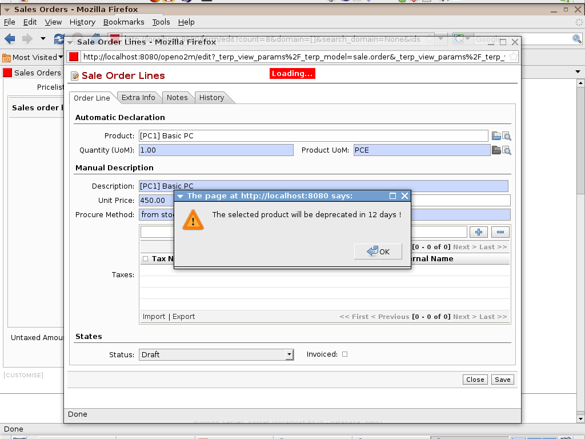

Alerts
======

Open ERP has an integrated alerts/warning system. You can configure alerts on any
step of any operation. The end-user will receive alerts on different events. We can
trigger alerts on the screen or through the internal requests system. It allows
to show the right information at the right time for each user. It also simplify
a lot the communication between the different employee of a same company.
 

Key Points:
-----------

* Pre-configured warning module,
* Configure messages on partners, products, etc.
* Fully customizable.

Integration Benefits:
---------------------

* The same alert can be triggered from different operations: sales, invoices, stock deliveries.
* The alert system is a generic concept that can be used in any module.

Links:
        
        Example : http://example.net
    
* Module: alerts

