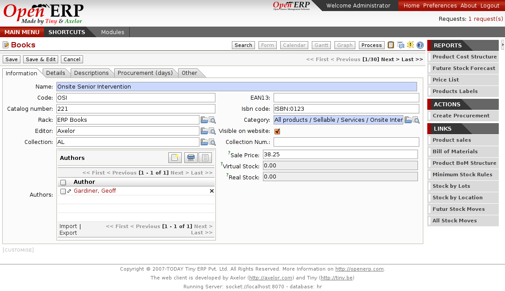

Book Stores
===========

Open ERP provides modules that configure automatically the system for
a book store. It allow to manages books, authors, editors and suppliers.
It manages barcodes and sales from the website, from a point of sale or
by quotation or phone.
 

Key Points:
-----------

* Integrates all needs of a book store
* Ready to use, out-of-the-box.

Integration Benefits:
---------------------

* Integrated with invoicing and accounting
* Integrated with Joomla website

Links:
------

        Demonstration: http://demo.openerp.com
