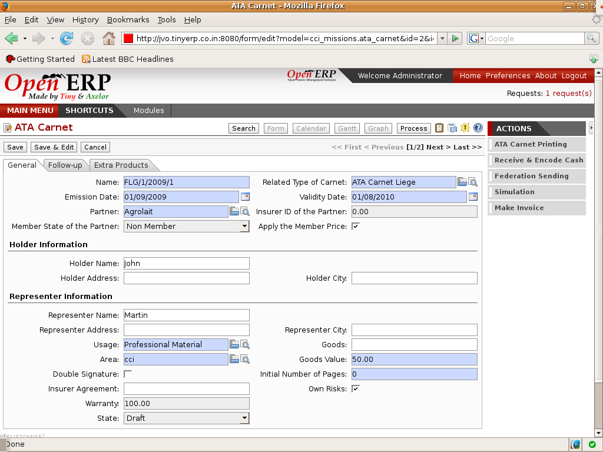

Chamber of commerce
===================

Open ERP is used by 50% of the Chamber of Commerce of Belgium. More than 10
modules are available for this specific business: advances CRM, contact
management, membership management, training and conferences organisation,
embassy folders, etc.
 

Key Points:
-----------

* Very complete
* About 10 optionnal modules

Integration Benefits:
---------------------

* Integration with accounting to provide invoicing automation
* Integration with the CRM for a global overview
* Integration with the document management system

Links:
------

        Demonstration: http://demo.openerp.com
