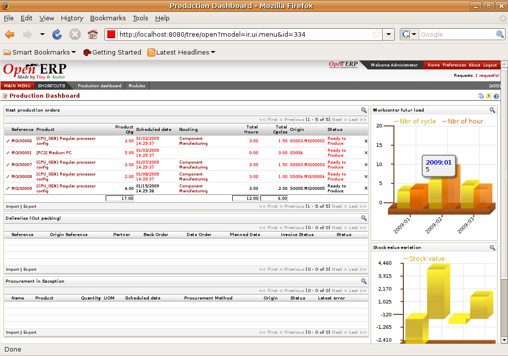

Dashboards
==========

Dashboards give you an overview of all the information that's important to you
on a single page. The menu gives you access to predefined boards for
Accounting, Production and Project Management.

Unlike most other ERP systems and classic statistically-based systems, Open ERP
lets dashboards be provided to all of the system's users, and not just to
directors and accountants.
 

Key points:
-----------

* Dashboards are dynamic, which enables you to easily navigate around the whole information base. 
* Dashboards are adaptable to the needs of each user and each company.

Integration benefits:
---------------------

* Users can each have their own dashboard to enable them to manage their own work efficently.

Links:
------

        Demonstration: http://demo.openerp.com:8080
