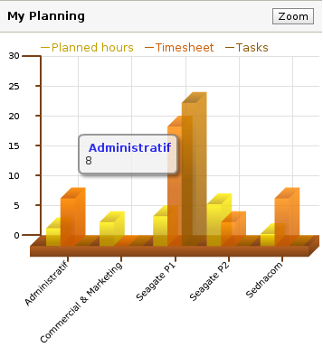

Dynamic Graphs
==============

Open ERP provides beautifull and graphic reports to provide the right
information to the user according to the context.  All graphs and dashboards in
Open ERP are fully dynamic, you can click on any part of the graph, drag and
drop in dasboards, switch to calendar or gantt views, etc.

With Open ERP, powerfull reporting are not only dedicated to managers, but
to any user of the system. Uses the 200+ reports to satisfy every employee
need and improve their performance by providing them the right information.
 

Key Points:
-----------

* 6 Views on all objects: list, form, graph, calendar, gantt, process
* A good ergonomy, fully Ajax, clickable and drag and drop enabled,
* All graphs are fully customizable using the view designer.

Integration Benefits:
---------------------

All Open ERP document may be seen as a graph, gantt, process or calendar view.
Here are a few examples: manage manufacturing chains with gantt, calendar of
consolidated CRM events, customized dashboard for managers, planning of
deliveries, etc.

Links

* Modules: 

