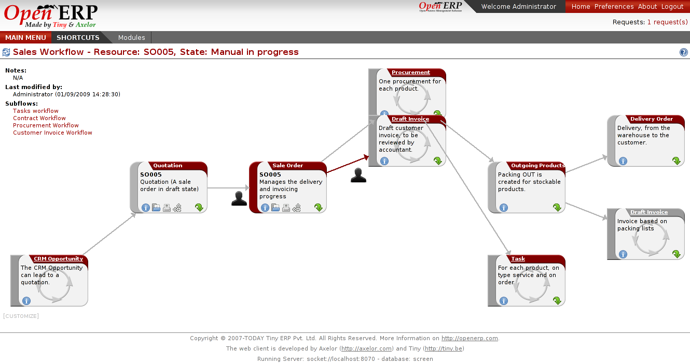

Business Process Management
===========================

Open ERP supports technical workflow and also end-users processes.
Introduction two or three lines.
 

Key Points:
-----------

* Integrated process designer to customize or integrate your methodology,
* Help the user to understand the globality of the company,

Integration Benefits:
---------------------

* Integrated to the document management system to provide samples of documents at any step
* Integrated with workflow to evolve in real time according to the reported document

Links:
------

* Modules:
