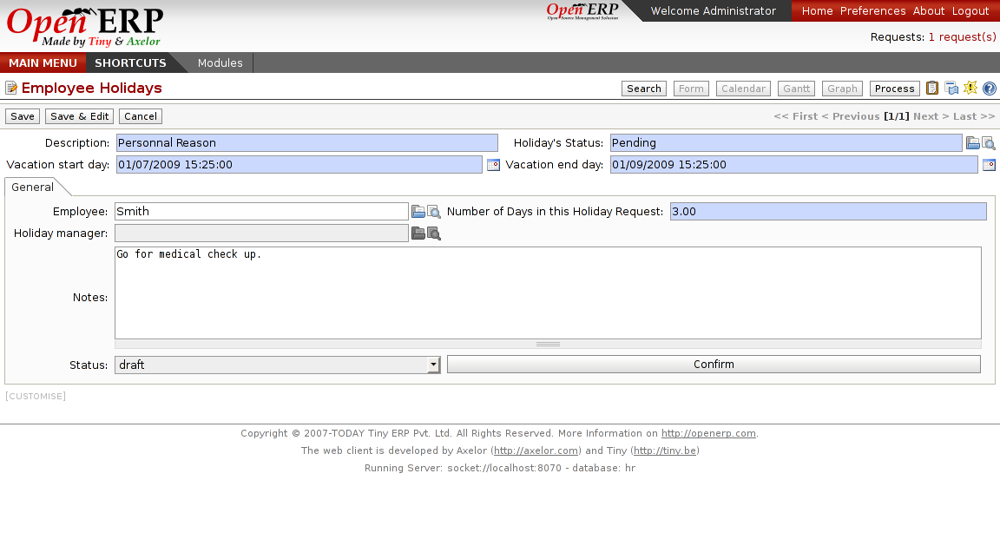

Holidays Management
===================

This module's main task is to control the holiday's schedule of your company.
It allow employee to requests holidays. Then, managers can review requests for
holiday, and control the overall holiday's planning for the company or departement.
 

Key points:
-----------

* Validation system included
* Customisable workflow for validation
* Support all kinds of leaving (sickness, holidays, paid days, ...)
* Calendar view

Integration benefits:
---------------------

* Integrated to the company calendar
* Integrated with the payroll system for automatic computation

Links:
------

* Module: hr_holidays

