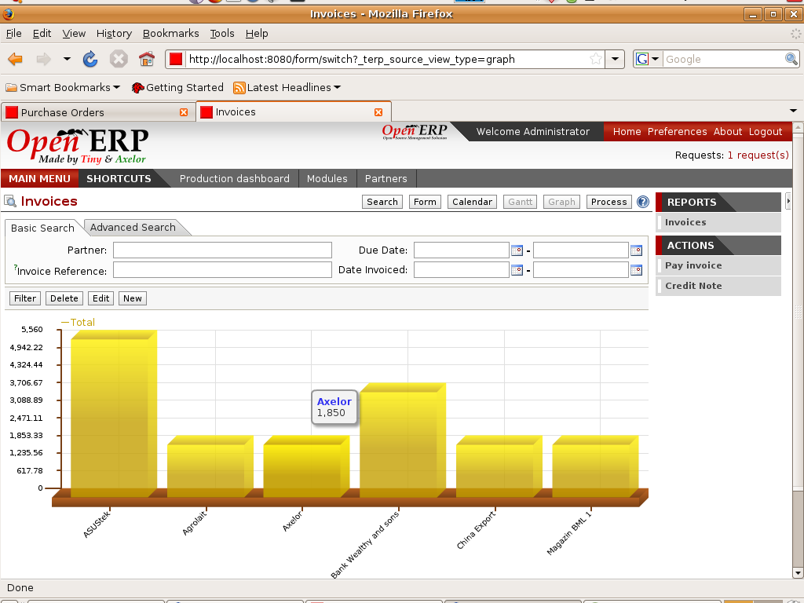

Invoicing
=========

Open ERP support lots of different logistics for the invoicing automation: from
the sales orders, from costs (timesheets, purchases, etc.), from tasks, from
recurring subscriptions, etc.
 

Key Points:
-----------

* A powerful pricelist system
* A very useful follow-up module

Integration Benefits:
---------------------

* No double encoding at all
* Automatic generation of invoices according to different workflows
* Integrated with analytic accounting for profitability

Links:
------

* Module:
