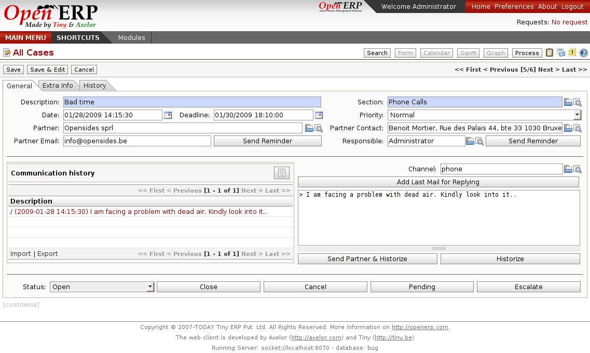

Mail Gateway
============

E-mail gateways can automatize and update cases in CRM via e-mails. Users can
create, assign or update cases to the CRM only by sending mails or receiving
mails without going into OpenERP interface. This module is a very useful tool
to manage all of generic mails from the company (info, sales, support,...) and
is dedicated to allow users to assign some cases.
 

Key points:
-----------

* Compatible with most of mail clients and servers.
* Mails are automatically classified by the system
* Multi Users

Integration benefits:
---------------------

* Totally integrated to the CRM modules

Links:
------

* Module:
