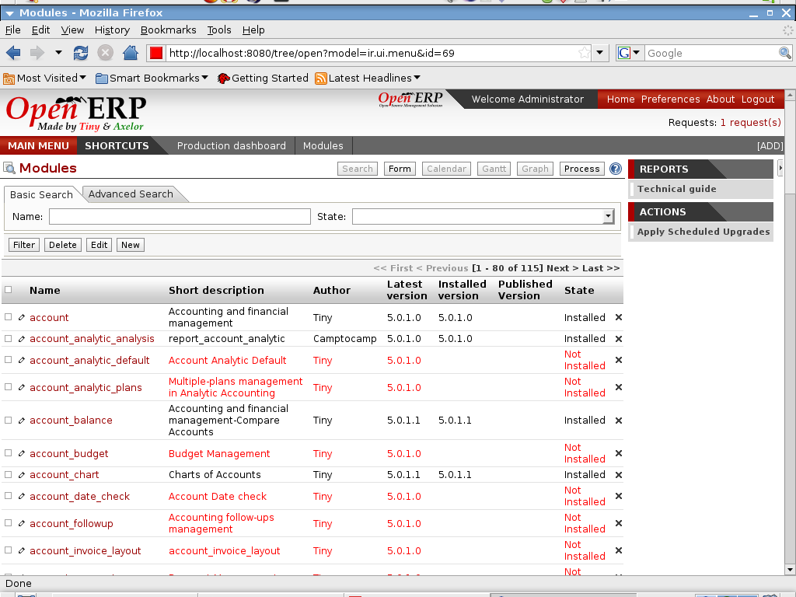

Module System
=============

Open ERP (and the Open Object framework) is probably the most advanced and
flexible framework in the world. All features of Open ERP are packaged as
independant module, allowing you to install only a few or a bunch of them.
They are able to work independently and, if installed together, they perfectly
integrates themselves to automate all tasks and avoid duplications of data.

You can also generate your own module without any line of development, using
our customization tools: workflow editor, object editor, view designer,
report designer, BI reports, customizable actions, etc. All customisations
made on the server can be saved as a module to easily deploy, redistribute and
share.
 

Key Points:
-----------

* Integrated ORM, Workflow Engine, BPM, BI, 
* Model View Control with lots of available views
* A very fast engine.

Links:
------

        List of modules: http://openobject.com

