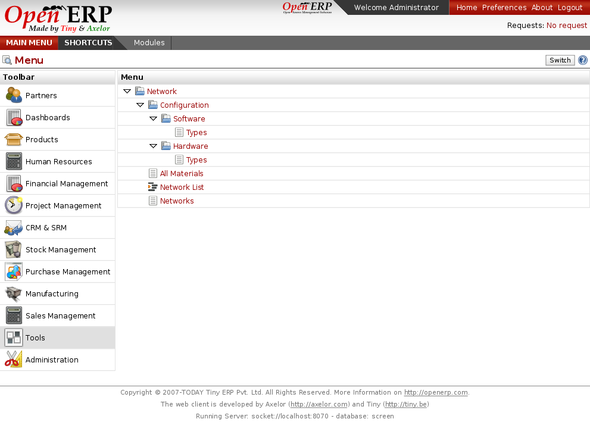

Networks
========

Open ERP has modules to help you to manages and maintain your IT infrastructure.
You can manage your softwares, licences, hardwares, waranties and control interventions
on the different components. Each components can be linked together to design your
network infrastructure.
 

Key Points:
-----------

* Manages networks, hardwares and softwares
* Track changes and interventions on components

Integration Benefits:
---------------------

* Install the module in three clicks
* Access controls related to users rights

Links:
------

* Modules: 

