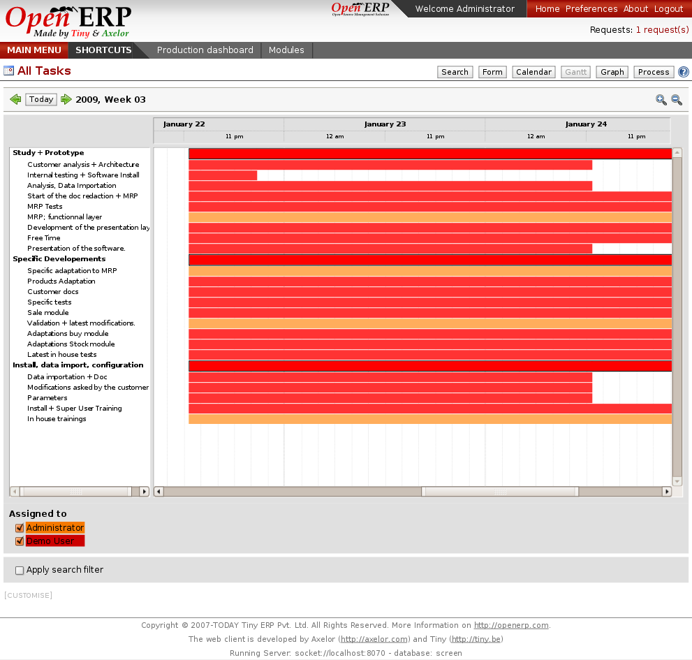

Operational Management
======================

Open ERP integrates a powerful multi-level project management system. It
allows to manages tasks allocation, short and long term plannings, delegations,
etc. It's fully integrated with sales or purchases.
 

Key Points:
-----------

* Dynamic Gantt view to organise projects and tasks
* Retro-Planning computations
* Integrates best practices: GTD, Scrum

Integration Benefits:
---------------------

* Integrated with analytic accounting for financial part
* Integrated with sales and invoicing to automates tasks
* Integrated with HR modules for the organisation of the resources

Links:
------

* Module:

