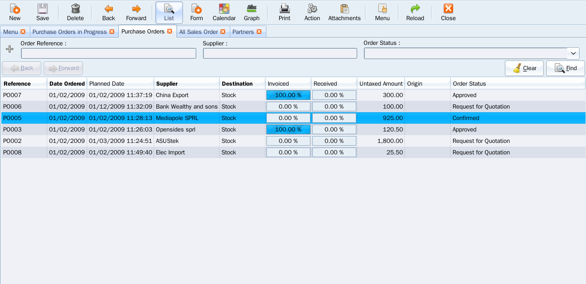

Purchases
=========

Purchase management enables you to track your suppliers' price quotations and
convert them into Purchase Orders as you require. Open ERP has several methods
of monitoring invoices and tracking the receipt of ordered goods.

You can handle partial deliveries in Open ERP, so you can keep track of items
that are still to be delivered on your orders, and you can issue reminders
automatically.

Open ERP's replenishment management rules enable the system to generate draft
purchase orders automatically, or you can configure it to run a lean process
driven entirely by current production needs.
 

Keypoints:
----------

* Purchase tender management,
* Integrates best practices: MTS / MTO, JIT, MPS, Kanban,
* Invoices, delivered products and services control.

Integration Benefits:
---------------------

* Automatic procurement propositions based on different logistics,
* Perfectly integrated with accounting, stock, manufacturing and project management.

Links:
------

* Module: purchase
