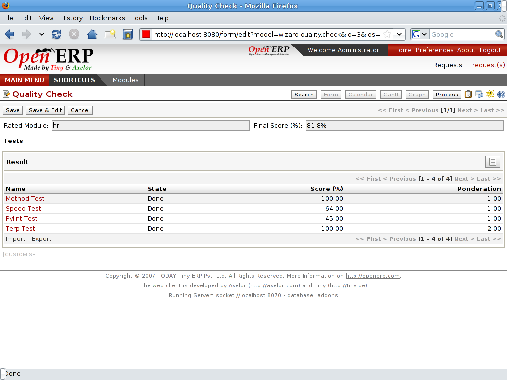

Repairs Management
==================

Open ERP provides a module to manage the quality of your products or
your services. The 'repairs management' module allows to organise
after-sales services.
 

Key Points:
-----------

* Complete after-sales services integrated
* Traceability of all operations

Integration Benefits:
---------------------

* Integrated with cost accounting for cost control of the quality
* Integrated with stocks to organise repairs and traceability

Links:
------

* Module:

