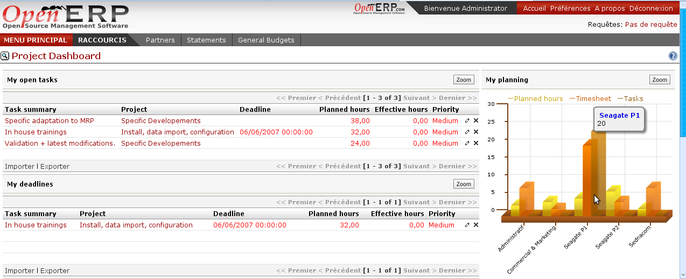

Services Management
===================

Service management allows you to manage your company's projects and tasks
without any limitations. It provides tools to manage multi-level sub-projects,
control tasks from project chief, alert customers by e-mails for project
support, schedule and prioritize tasks assigned,  etc.
 

Key points:
-----------

* Specific menus for specific users according to their roles
* History of interventions for each task and project
* Schedule control

Integration benefits:
---------------------

* Completely inetgrated to the cost accounting
* Automatic completion of timesheets
* Reports and dashboards incorporated

Links:
------

        Demonstration: http://demo.openerp.com:8080/login?user=admin&passwd=admin&db=service_en
        
* Module: profile_service
