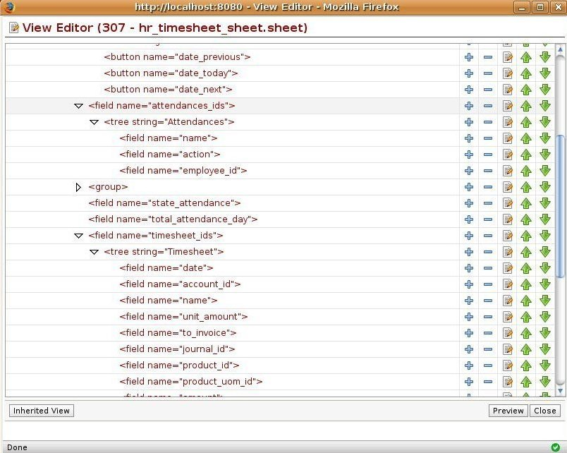

View Editor
===========

The Open ERP view editor allows you to design and adapt all screens of
the application to your specific need. You can modify the look or add/remove
new fields in a few seconds.
 

Key Points:
-----------

* Modify views but also the object structure
* Works with inheritancies of views to not change official version
* Ability to save all modification in a reuseable module

Integration Benefits:
---------------------

* This customization tool works on all modules

Links:
------

* Module:
