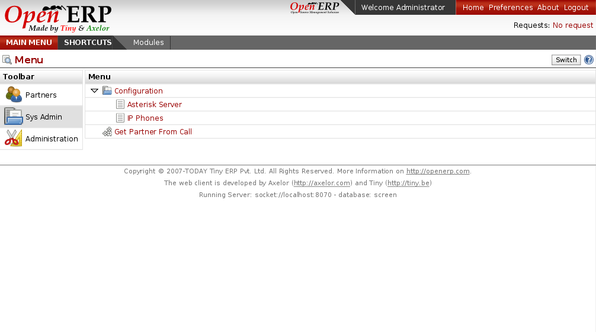

VOIP
====

The asterisk module allows to interface your Voice Over IP system with Open
ERP. When a customer calls you, it can propose the automatically the partner
form linked to this phone number.
 

Key Points:
-----------

* Asterisk interface

Integration Benefits:
---------------------

* Integrated with the phone tools of the CRM
* Link on any document to call a partner

Links:
------

* Module:
