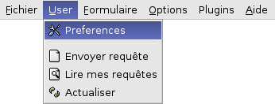

.. _general-configuration-link:

General Configuration Questions
-------------------------------

.. _setup-a-postgresql-user-and-database-link:

Setup a Postgresql user and database
++++++++++++++++++++++++++++++++++++

When the installations of the required software are done, you have to create a
database. The rights on the database are given to the postgres user by default.
You have to add the common-used user on which OpenERP is installed.

This assumes PostgreSQL is installed and running on your server.

For an installation which need full UTF8 character support consider to use
postgres >= 8.2.x. Prior to this tiny search will eventually not return the
expected results for case insensitive searches, which are used for searching
partners, products etc.

Example: ::

  SELECT 'x' FROM my_table WHERE 'bét' ilike 'BÉT'
  --matches only in 8.2.x

You have to create one database user and one database schema. (Make sure you
create an Unicode database, otherwise the server won't start correctly.)

The default superuser for PostgreSQL is called postgres. We will use it below
as an example. If you wish to use it as well, you may need to login as this
user first. ::

  johndoe$ sudo su - postgres
  password: XXXXXXXXXX
  postgres$

The default installation of PostgreSQL sets security to allow access without
password for localhost connections. This is called the trust security model.

If you run the database on the same host as the OpenERP server there is really
no need for a password, as long as you know what you are doing (or is alone on
the computer). To do without a password, simply leave the -P option out.::

  $ createuser -U postgres --createdb --no-adduser -P terp
  enter password:  XXXXXXXXXX
  repeat password: XXXXXXXXXX
  CREATE USER
  $ createdb -U postgres -O terp --encoding=UNICODE terp
  CREATE DATABASE

Then, you can start/restart OpenERP Server: ::

  $ sudo /etc/init.d/tinyerp-server restart

Setting up OpenERP to country/language needs
++++++++++++++++++++++++++++++++++++++++++++

Loading a translation file into the server

Most of Tiny ERP interface (GUI) is defined on the server, including the texts.
The client has only a few messages, like the ones shown in this picture below.
Thus to make a language available, one has to make them known on the server.

Tiny ERP works in English by default. Other languages are not available until
you load them into the server.

To import the file containing the translation, run: ::

  ./tinyerp-server.py --i18n-import=file.csv -lLANG 

This has to be done only once.

Now the user can select the new language in the clients User -> Preferences
menu. An administrator can also change these preferences (including users'
language) in the Application-Menu: Administration > Users > Users. He has to
choose an user and click on the preference icon.

.. For more information about translations (like creating new languages), please
.. refer to the [| Translations ] page.  Setting up Accounting Trees

.. todo:: to be written

Setting up Mailgate
+++++++++++++++++++

What is Mailgate
""""""""""""""""

Mailgate is a Python script which can process incoming emails and create a CRM
case from the email.

Mailgate Installation
"""""""""""""""""""""

Mailgate is provided with the Tiny distribution and included with the CRM
module. You can find the script here: ::

  <server install directory>/bin/addons/crm/scripts/tinyerp-mailgate/tinyerp-mailgate.py

Mailgate setup
""""""""""""""

Mailgate is an MDA (Mail Delivery Agent) and can manage messages sent to it
from another MDA or an MTA (Mail Transfer Agent). It has very basic mail
handling functions, so logic for managing valid domains / addresses / junk mail
blocking, etc should be managed within the MTA Mailgate command line options: ::

  "--version", "show program's version number and exit"
  "-h", "--help", "show help message and exit"
  "-u", "--user", "ID of the user in OpenERP", default=3
  "-p", "--password","Password of the user in OpenERP", default='admin'
  "-e", "--email","Email address used in the From field of outgoing messages"
  "-s", "--section","ID or code of the case section", default="support"
  "-m", "--default","Default eMail in case of any trouble."
  "-d", "--dbname", "Database name (default: terp)"

CRM Section Setup
"""""""""""""""""

Ensure you create an entry in the "code" of a section and specifiy this code as the section on the command line with the -s flag.

Mailgate with Linux MTA
"""""""""""""""""""""""

Fetchmail
^^^^^^^^^

The program fetchmail is a 3rd party program to fetch mail from a POP, IMAP, ETRN, or ODMR-capable server. It can be found at http://fetchmail.berlios.de/. On debian it can be installed as::

  apt-get install fetchmail

One downloaded and installed, you need to configure fetchmails' parameters. These can be found in the file addons/crm/scripts/tinyerp-mailgate/fetchmailrc an example is given, and for another example, these are my settings: ::

  poll mail.mydomain.net proto pop3 port 995 :
  username "helpdesk" password "mypw" mda 
  "/home/terp/addons/crm/scripts/tinyerp-mailgate/tinyerp-mailgate.py -u 3 -p admin -s SECEMAIL -e 
  me@mydomain.com -m me@mydomain.com -d mydb"

Following this format: ::

  poll <your pop server name proto pop3: username <pop3 username> password <pop3 Password> mda "<path to Mailgate>/tinyerp-mailgate.py -u<Tiny User ID> -p<Tiny User Password> -s<Tiny case section> -e<sender email> -d<Fallback Email Address>"

.. note:: to see the list of all parameters for the tinyerp-mailgate program,
   type ./tinyerp-mailgate.py --help in the addons/crm/scripts/tinyerp-mailgate
   directory.

.. note:: if you are using a port other than the default port of 8069, you will
   need to add your port number directly into the file tinyerp-mailgate.py

.. note:: if you are using a secure connection for OpenERP, you will need to
   edit the file tinyerp-mailgate.py and change the word http for https.

Once your fetchmailrc file is setup, you can test it by first sending an email
to your helpdesk - in my case this is helpdesk@mydomain.com. Then run
fetchmail, giving it your fetchmailrc as a parameter ie. fetchmail --ssl -f
./fetchmailrc This assumes that you are in the directory
addons/crm/scripts/tinyerp-mailgate.

And you should have output similar to: ::

  reading message helpdesk@www.mydomain.com:1 of 2 (1555 octets).* Email parser
  test402 3 admin
  Section ID 4

  -.- ICI
  Mail Sent to  test402 3 admin
  test402 3 admin
  Case 36 created...
  test402 3 admin
  []
  flushed
  reading message helpdesk@www.mydomain.com:2 of 2 (1534 octets).* Email parser
  test402 3 admin
  Section ID 4

  -.- ICI
  Mail Sent to  test402 3 admin
  test402 3 admin
  Case 37 created...
  test402 3 admin
  []
  flushed

Sendmail
^^^^^^^^

.. todo:: to be written

Procmail
^^^^^^^^

.. todo:: to be written

Troubleshooting
"""""""""""""""

Ubuntu 6.06 + Tiny 4.0.3
^^^^^^^^^^^^^^^^^^^^^^^^

For Ubuntu Server 6.06 with tinyerp 4.0.3 the following fixes worked for me:

Use the 4.1.1 mailgate by downloading the source and copying the file
/tinyerp-server-4.1.1/bin/addons/crm/scripts/tinyerp-mailgate/tinyerp-mailgate.py
to
/tinyerp-server-4.0.3/bin/addons/crm/scripts/tinyerp-mailgate/tinyerp-mailgate4.1.1.py
Then modify line 130 of tinyerp-mailgate4.1.1.py to read as follows(notice the
#): ::

  message['body'] += part.get_payload(decode=True)#.decode(part.get_charsets()[0])

Finally you can use the following in your fetchmailrc: poll
pop.secureserver.net proto pop3: username mypop3username password
mypop3password mda
"/tinyerp-server-4.0.3/bin/addons/crm/scripts/tinyerp-mailgate/tinyerp-mailgate4.1.1.py
-u3 -pmytinypassword -ssupport -emyemailaddress -mmyemailaddress -dmydatabase"

