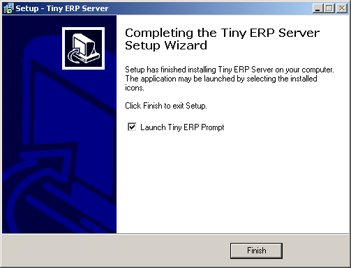
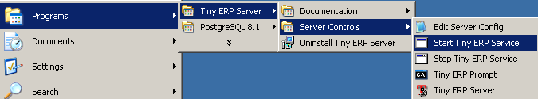
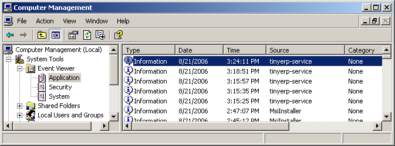
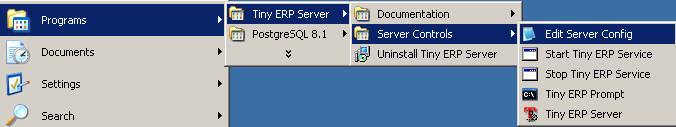
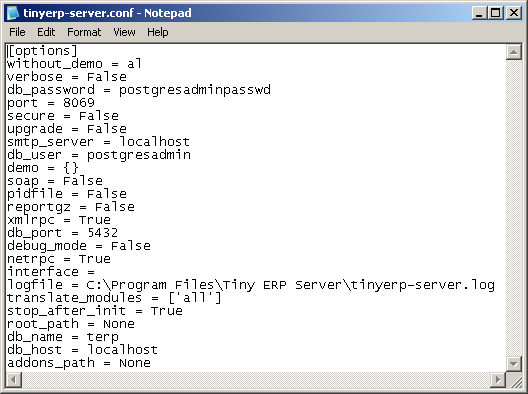

OpenERP Server for Windows
""""""""""""""""""""""""""

Installation of Open ERP Server on all Windows (NTFS)

System Requirements
^^^^^^^^^^^^^^^^^^^

The server installation works on Windows 2000 and XP, Vista, Windows Server 2000, 2003 and
2008 with disks formatted in NTFS (not a FAT or FAT32 partition). Open ERP Server doesn't
work on Windows 98 or ME; for obvious reasons -- these can't be formatted using NTFS.

If you want to use Open ERP, you have to install both the Open ERP Server and the ERP Client
Installation of ERP Client

Dependencies
^^^^^^^^^^^^

For installing the server you have to:

 * Install the database: PostgreSQL 8
 * Install Open ERP Server with the auto-installer

Open ERP server depends on the database, you have to start by installing the database first.
The connection to an Open ERP server is required for the client to function. The connection
can either be local(on the same computer) or on the network (on a distant server/s) using
OpenERP Server, OpentERP Client and PostgreSQL on three different servers, however for
simplicity sake this manual will be looking after the installation on one box/node.

PostgreSQL Installation
^^^^^^^^^^^^^^^^^^^^^^^

If you already have PostgreSQL installed and configured, you can skip to the :ref:`Preparation of
a new database <preparation-of-a-new-database-for-open-erp-server-link>` section.

Get PostgreSQL
##############

Download

 * PostgreSQL 8

   * File: postgresql-8.2.9-1.zip
   * http://www.postgresql.org/ftp/binary/v8.2.9/win32/

.. note:: If you plan to use OpenERP V4.3 or higher, feel free to search for
   the packages listed and download the latest stable release at:
   http://www.postgresql.org/ftp/binary/.

Install PostgreSQL 8
####################

The downloaded archive contains four files, you need all four of them to be in the same
directory!

Unzip the complete archive in one directory and launch the installation program by executing
the postgresql-8.2.msi file.

Within the first few steps you will be asked to choose the components to be installed, you
can leave the defaults.

There are two sets of usernames and passwords which will be important later on:

 1. The first set is requested when you get to Service configuration during the installation
    wizard. This is where a service account is setup for running the [=PostgreSQL=] database
    server. You may not need this login in the future but record it in case you do.

 1. The second set is needed to access the database, you should make sure to note this
    username and password, it will be needed later during the installation.

.. image:: ../../img/Pgsql_install.service_configuration.png

The Account domain should be the same as the name of your server.

You may get a warning that your password is too weak to correctly protect the database, in
that case you can change it with a random generated one or keep yours.

.. image:: ../../img/Pgsql_install.weak_pwd.png

puis

.. image:: ../../img/Pgsql_install.init_cluster.admin_login_def.png

At the Initialise database cluster screen, you will need to input a Superusername and
password. This login is for the internal database and will be necessary to create database
for your OpenERP server.

The default options for all remaining screens should work just fine.

Now you have PostgreSQL installed and configured, you have to create a database for your
OpenERP server.

.. _preparation-of-a-new-database-for-open-erp-server-link:

Preparation of a new database for Open ERP Server
^^^^^^^^^^^^^^^^^^^^^^^^^^^^^^^^^^^^^^^^^^^^^^^^^

If you have an already existing database or you are upgrading the version, please proceed to
the next section.

Open a command prompt from the PostgreSQL program menu:

.. image:: ../../img/Pgsql_menu.launch_cmd_pgsql.png

This takes you directly to the bin directory of PostgreSQL and use this command: ::

 createdb -U <database_superuser_username> --encoding=UNICODE terp

.. 

 * terp will be the name of the database which will be created
 * database_superuser_username is the name of administrator you entered in the "initialise
   cluster" screen of PostgreSQL setup.

Don't forget to specify the option "Encoding". Without this option the data wouldn't be
recorded with the right format, and you can encounter errors when using Open ERP!

.. image:: ../../img/Pgsql.psql_cmd.png

If you see a command with text to complete according to your configuration, usually it's
between two brackets <>, it's just a notion and it is not needed to write your text with the
brackets. For example <your_database_username> means postgresadmin in this particular
example.

Sample command prompt: ::

 C:\Program Files\[=PostgreSQL=]\8.2\bin>createdb -U postgresadmin --encoding=UNICODE terp
 Password: <enter password again>
 CREATE DATABASE

 C:\Program Files\[=PostgreSQL=]\8.2\bin>

Here you have to enter the username and password initialized in the Initialise database
cluster screen.

Your output may differ, and if you're prompted a second time for the password just input it
again. You can try the same command again, and after entering the password it would display
this error:

.. image:: ../../img/Pgsql.cmd_init_retest.png

This error means that there is already one database with the same name.

Now you are ready to setup the Open ERP Server.

Open ERP Server Installation
^^^^^^^^^^^^^^^^^^^^^^^^^^^^

Download the Open ERP Server
############################

 * Open ERP Server

   * File: tinyerp-server-X.Y.Z.exe
   * http://openerp.com/downloads.html

Install Open ERP Server
#######################

Install it with the auto-installer you have just downloaded.

The ERP server installs also as a Windows service. This means you don't have to start the
server each time you start the computer and it runs without the need of an open user
session.

At the end of the installation, the setup wizard proposes to open, Open ERP Prompt, from
where you can prepare your server, as described below.

Preparing the server for the first time run
^^^^^^^^^^^^^^^^^^^^^^^^^^^^^^^^^^^^^^^^^^^

The Windows service for Open ERP Server is installed during the installation and it's set up
to start the server automatically on system boot.

The configuration file is now automatically saved in the installation directory, in: ::

 C:\Program Files\TinyERP Server\tinyerp-server.conf

Open ERP Prompt
###############

At the end of installation, the setup wizard proposes to open an Open ERP Prompt.

To start the server manually, start the Windows Command prompt and navigate to the
installation directory in "C:\Program Files\TinyERP Server\":

or in a previous version:

.. image:: ../../img/Terp_prompt.cmd_serverhome.png

You need to initialize the ERP server and save its configuration for the service to be able
to start automatically.
 You also need to specify a logfile to be able to read the output the server writes
during its execution.

When in the Server directory, type this command but don't execute it yet: ::

 tinyerp-server.exe -d <db_name> -r <db_user> -w <db_password> --db_host=localhost
 --db_port=5432 --logfile="<logfile>" -s --stop-after-init

The initialization of Open ERP Server provides the necessary informations for the connection
to the database PostgreSQL and indication of the choice of data to load. Here is the
explanation of used options:

 * -d <db_name> : Name of the database created for Tiny ERP Server.
 * -r <db_user> : Name of the [=PostgreSQL=] administrator.
 * -w <db_password> : Administrator's password.
 * --db_host=<postgresql_server_address> : Address of the server where [=PostgreSQL=]is, if
   you have installed [=PostgreSQL=] on the same computer as Open ERP Server, you can enter
   localhost, or the IP address or the name of the distant server.
 * --db_port=<port_no> : Port number where listens [=PostgreSQL=]. Default is 5432.
 * -s : This option allows you to save the options in configuration file of Tiny ERP Server.
 * --stop-after-init: This option stops the ERP server after initialization.
 * --logfile="<logfile>": specify a logfile where all the output of ERP Server will be
   saved.

Before execution of this command you have to decide what usage you want the Open ERP for:
see the next section! The command is on only one line, the other long commands as well.

Sample command: ::

 tinyerp-server.exe -d terp -r postgresadmin -w postgresadminpasswd
 --db_host=localhost --logfile="C:\Program Files\TinyERP Server\tinyerp-server.log"
 --db_port=5432 -s  --stop-after-init

Here you have to enter the username and password initialized in the Initialise database
cluster screen.

When you will execute the initialization command, if you specified a logfile, you will not
see any server output in the prompt window.

Everything is written to the logfile. You have only to wait until the prompt comes back.

Deciding what is the purpose of the server
^^^^^^^^^^^^^^^^^^^^^^^^^^^^^^^^^^^^^^^^^^

You have three possibilities for the first launch. This section is really important because
the correct initialization can be crucial.

You can initialize the database with Open ERP Server to:

 1. You want to take a look on the system with demo data loaded
 2. You are installing a new clean installation (without demo data)
 3. You are upgrading an existing version.

First time run with demo data
#############################

To initialize Open ERP Server with the demo data, you need to add this option to the above
command: ::

 --init=all

Sample command: ::

 tinyerp-server.exe -d terp -r postgresadmin -w postgresadminpasswd
 --db_host=localhost --logfile="C:\Program Files\TinyERP Server\tinyerp-server.log"
 --db_port=5432 -s  --stop-after-init --init=all

This command will initialize the Open ERP Server and fill its PostgreSQL database with the
demo data.

First time run without demo data (or new clean version)
#######################################################

Execute the command with an option excluding the demo data: ::

 --without-demo=all

This will load all modules, but will not load the demo data.

Sample command usage: ::

 tinyerp-server.exe -d terp -r postgresadmin -w postgresadminpasswd
 --db_host=localhost --logfile="C:\Program Files\TinyERP Server\tinyerp-server.log"
 --db_port=5432 -s  --stop-after-init --without-demo=all

Recreate a new database:If you have more than one database , you may force the server to
initialize by using the "-i all" or "--init=all" command line option.

If you already initialized the database and you have the demo data loaded, you can recreate
a new database

First time run with an upgraded version of Open ERP Server
##########################################################

Execute the command with an option that updates the data structures: ::

 --update=all

Sample command usage: ::

 tinyerp-server.exe -d terp -r postgresadmin -w postgresadminpasswd
 --db_host=localhost --logfile="C:\Program Files\Tiny ERP Server\tinyerp-server.log"
 --db_port=5432 -s  --stop-after-init --update=all

You can find more detailed information on the pages about [Maintaining Updates].

Starting the server
###################

Now as the server is initialized and the settings are saved, you can finally start the Open
ERP Server service.

In the menus there is an icon that directly executes the ERP server, but it is only for
debugging or testing purposes.

From the command prompt
#######################

You can now start the Open ERP Server service from the command prompt with a simple command: ::

 net start tinyerp-service

.. image:: ../../img/Terp_service.start.png

You can also stop it in a similar way, in case the service is running but you need to
reconfigure it: ::

 net stop tinyerp-service

.. image:: ../../img/Terp_service.stop.png

From the main program menu
##########################

You can also control the service from the Program menu:

From the service manager
########################

The service and some runtime information is also accessible in the Computer management in
Administration tools.

.. image:: ../../img/Terp_service.mmc_terp_service.png

.. 

The logging service offers additional information about the execution of the Open ERP Server
service.

In the service manager you can define how the service should act in case of server failure.

.. image:: ../../img/Terp_service.mmc_control_actions.png

Monitoring Open ERP Server
^^^^^^^^^^^^^^^^^^^^^^^^^^

You can find startup or shutdown information in the Computer Management logging service.

Open ERP Server runtime output can be found in the logfile you specified on the
initialization command line.

Given that the server is now running as a Windows service, it doesn't output any runtime
messages, for this the logfile is the only option.

You can find out whether Open ERP Server is running by opening the Windows Task Manager and
when you look at the Processes tab, you will see TinyERPServerService.exe and tinyerp-
server.exe and that these two processes are running as SYSTEM user.

Configuring Open ERP Server
###########################

Open ERP Server menu contains a direct link to the configuration file used by the service.
This way you can edit the configuration and then restart the service to load the new
configurations.

Be extremely cautious when editing the server configuration directly, you can crash the
entire system with inappropriate values.

Congratulations, you have successfully installed the Open ERP Server
^^^^^^^^^^^^^^^^^^^^^^^^^^^^^^^^^^^^^^^^^^^^^^^^^^^^^^^^^^^^^^^^^^^^

For more information, please take a look at the  :ref:`Additional Installation
Information and Troubleshooting
<troubleshooting-and-windows-complementary-install-information>` page where you
can find some troubleshooting examples.

