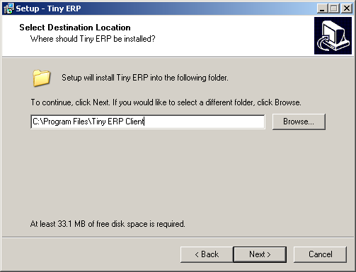

.. index::
   single: Installation; Open ERP Client (Windows)
   single: Open ERP Client; Installation (Windows)
.. 

.. _installation-windows-client-link:

Open ERP Client Installation
============================

The Windows client installation is very simple. There are 6 stages :

  #. Welcome message.
  #. GPL Licence Acceptation
  #. Shortcut in the Start menu.
  #. Creation of a 'Start' icon on the desktop
  #. Confirmation Choices
  #. Automatic installation

You have to install, configure and run the Open ERP Server before using the
Open ERP Client. The client needs the server to run. You can install the server
application on your computer, or on an independent server accessible by
network.

Downloading the Open ERP client
-------------------------------

The Open ERP client can be downloaded from
the `Open ERP website's download page <http://www.openerp.com/index.php?option=com_content&view=article&id=18&Itemid=28>`_

Installing the Open ERP client
------------------------------

CLick on the executable installation file you've just downloaded and select the installation path.

Starting the Open ERP client
++++++++++++++++++++++++++++

The installation program creates shortcuts in the main program menu and on the desktop.
Be sure to have an Open ERP Server running somewhere (on your computer or on a
distant server) to be able to use the Client software.

Passwords:

Log in to TERP database using default username and password

  * Username = admin
  * Password = admin

Enjoy!

