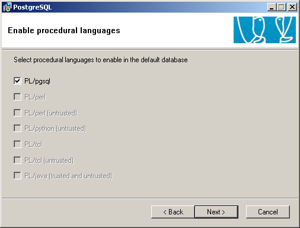
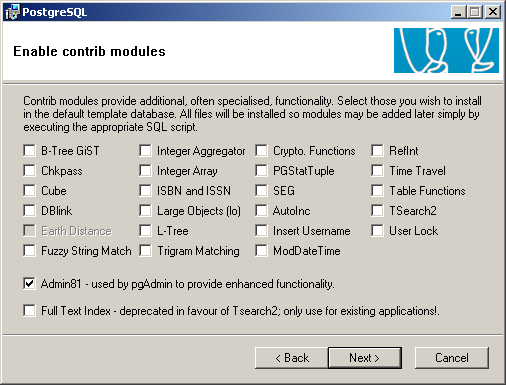
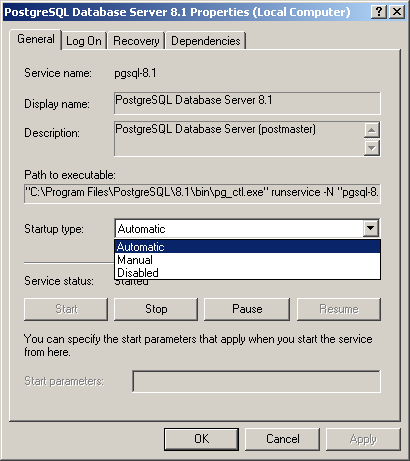
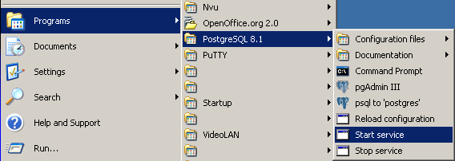

.. index::
   single: Installation; Windows installation quirks
   single: Installation; Windows Vista
   single: Installation; Windows 2000/XP
.. 

.. _troubleshooting-and-windows-complementary-install-information:

Troubleshooting and Windows Complementary Install Information
=============================================================

Windows Vista
-------------

For Windows Vista installation please review this forum posts

  * `http://openerp.com/forum/topic4484.html <http://openerp.com/forum/topic4484.html?highlight=windows%20vista>`_
  * `http://openerp.com/forum/topic4386.html <http://openerp.com/forum/topic4386.html?highlight=windows%20vista>`_

Windows 2000/XP
---------------

PostgreSQL Installation
+++++++++++++++++++++++

Default values
""""""""""""""

.. describe:: PL/PGSQL language inclusion in the installation:

leave the default selection:

.. describe:: Contrib modules screen:

You don't need to change the default selections:

Account Domain lookup failure
"""""""""""""""""""""""""""""

If you see this screen at the end of PostgreSQL installation, it is due to an incorrect ``Account domain`` in the Service
configuration screen. By default the installer fills this value automatically, so if you have changed it, it may cause the
installation to fail.

Redo the installation of PostgreSQL and leave ``Account domain`` in the Service configuration screen on the default value.

User account error
""""""""""""""""""

During the installation of PostgreSQL you may get an error saying:

Account ``@#$%@#$^@%`` doesn't exist

This error was encountered once with the Open ERP Complete Autoinstaller.

The problems seems to be that in order to install PostgreSQL automatically in silent mode, we create a new user account with
the net.exe command, and in that particular case the system's security policy was too strict to allow a simple non
privileged user to be added this way.

It could also fail if you are using Active Directory to manage the user accounts. In that case you should use the individual
Open ERP Server, Client and PostgreSQL installers.

PostgreSQL administration
+++++++++++++++++++++++++

Open ERP Server Connection Error with PostgreSQL
""""""""""""""""""""""""""""""""""""""""""""""""

Verify that you are using the username and password from the "Initialise database cluster" screen
when launching Open ERP Server

If there's another problem similar to this situation:

You should have look if the service PostgreSQL is running in the Services manager (Control Panel : Administration tools -
> Services)

You can edit the service configuration to have PostgreSQL starting as a service at system boot

Or you can start it manually every time from the programs menu.

If your PostgreSQL service is running, but you get connection errors, you can restart the service.

GTK client localization
+++++++++++++++++++++++

Open ERP GTK client upper menu not translated
"""""""""""""""""""""""""""""""""""""""""""""

The locale identifier of Microsoft Windows (a number such as 1033 for english - US) is not correctly managed by GTK and the
menus not translated into the language of the OS.

You can fix this problem with creating a new environment variable :

 #. Right-click My Computer, and then click Properties.
 #. Click the Advanced tab.
 #. Click Environment variables.
 #. Click New to add a new system variable with name "LANG" and value "fr_FR" for example.

